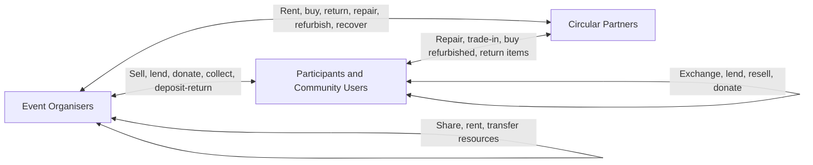

# ReEvent: Circular Event Resource Management Mobile App

## 1. Project Definition

**Project name:** ReEvent

**Core idea:** ReEvent is a mobile application that helps event organisers, participants, and circular-economy partners reduce waste by sharing, reusing, repairing, returning, reselling, donating, refurbishing, and recycling event-related resources.

**One-sentence pitch:** ReEvent turns every event into a circular resource network where materials, props, equipment, merchandise, and leftover assets are tracked before, during, and after the event so they can be reused instead of wasted.

**Assignment fit:** This project directly supports **UN Sustainable Development Goal 12: Responsible Consumption and Production** by reducing unnecessary consumption, improving resource efficiency, encouraging sustainable behaviour, and closing the loop for event materials.

---

## 2. Honest Review of the Original Idea

Your team's idea is strong and highly relevant to the assignment, but it needs to be refined so it does not become too broad or unrealistic.

### 2.1 Why the Idea Is Strong

The idea works well because events often create a large amount of short-term consumption. Concerts, exhibitions, school events, government programmes, birthday parties, university fairs, conferences, and festivals usually require:

- Banners
- Booth materials
- Decorations
- Tables and chairs
- Lighting equipment
- Costumes
- Props
- Merchandise
- Packaging
- Signage
- Reusable containers
- Temporary structures
- Electrical accessories
- Sound equipment
- Display boards
- Stationery
- Gift bags

Many of these items are only used once or for a very short period. After the event, they may be thrown away, stored without purpose, or replaced for the next event even if they are still usable.

This creates a real sustainability problem:

- Over-purchasing of new materials
- Poor post-event recovery
- Lack of tracking for reusable items
- No simple way to find future users for leftover items
- No clear connection between organisers, users, and repair/recycling partners
- Waste being treated as rubbish even when it still has value

Because the problem is real, visible, and easy to demonstrate, it has strong potential for a high-scoring mobile app project.

### 2.2 Main Weakness in the Original Idea

The original version says that all three parties can exchange resources with each other:

- User
- Event organiser
- Factory/company

This is good as a starting idea, but it needs more precision. The biggest weakness is that **factories and companies will not accept every type of used item or waste**. In the real world, a manufacturer usually has specific rules:

- What materials they accept
- What condition the item must be in
- Whether the item is repairable
- Whether trade-in is allowed
- Whether the item has resale value
- Whether recycling is technically possible
- Whether transport cost is worth it
- Whether the material is safe and legal to handle

Therefore, the app should not simply say "sell waste back to factories". That sounds too idealistic. A better and more realistic term is **Circular Partners**.

### 2.3 Refined Direction

Instead of only saying "factories/companies", ReEvent should use this stakeholder group:

**Circular Partners:** organisations that can help keep event resources in use, including manufacturers, suppliers, rental companies, repair shops, refurbishers, recycling companies, upcycling businesses, donation centres, NGOs, logistics providers, and second-hand resellers.

This makes the idea more realistic and more professional.

---

## 3. Final Refined Concept

ReEvent is a multi-role mobile platform for circular event resource management.

The app supports three main groups:

1. **Event Organisers**
   - Create events
   - Register resources
   - Track item condition
   - Rent, borrow, sell, donate, repair, return, or recycle items
   - View environmental impact

2. **Participants and Community Users**
   - Discover reusable event items
   - Buy, rent, borrow, exchange, or donate resources
   - Return deposit-based items
   - Send items for repair
   - Join sustainability challenges

3. **Circular Partners**
   - Offer take-back programmes
   - Repair damaged items
   - Refurbish or resell products
   - Accept recyclable materials
   - Provide rental or reusable resources
   - Report recovery outcomes

The main innovation is the **Digital Resource Passport**. Every important item receives a digital record and QR code that stores:

- Item name
- Category
- Material type
- Quantity
- Owner
- Current location
- Event history
- Condition
- Repair history
- Reuse count
- Estimated value
- Recommended next action
- Accepted recovery options
- Environmental impact saved

This makes the app more than a marketplace. It becomes a circular economy tracking system for events.

---

## 4. Circular Economy Loop Model

The app should not present the system as a simple buying and selling app. It should present the system as a resource loop.

### 4.1 Event Organiser to Circular Partner

Possible actions:

- Buy reusable resources from suppliers
- Rent equipment instead of buying new
- Return unused materials
- Trade in old items for discount
- Send broken equipment for repair
- Send damaged but valuable items for refurbishment
- Send recyclable materials to approved recyclers
- Sell reusable items to second-hand partners

Example:

A university event organiser has 50 reusable booth panels after a career fair. Instead of throwing them away, the organiser scans the QR codes, checks their condition, and ReEvent recommends:

- Store 30 panels for the next event
- Rent 10 panels to another organiser
- Send 5 damaged panels for repair
- Send 5 unusable panels to a recycling partner

### 4.2 Event Organiser to Participant/User

Possible actions:

- Sell official merchandise
- Collect merchandise for reuse or recycling
- Offer reusable cups or containers with deposit return
- Let participants rent event equipment
- Allow attendees to claim leftover decorations or materials
- Donate leftover event items to student clubs or community groups

Important correction:

Selling merchandise from organiser to participant is not automatically circular. It becomes circular only when the merchandise has a reuse, repair, resale, return, or recycling pathway.

Better circular examples:

- Reusable cup with deposit return
- Event shirt made from recycled material with take-back programme
- Badge holder returned after event
- Booth decoration collected for reuse
- Merchandise resold through the app after event
- Leftover gift bags donated or reused for another event

### 4.3 Participant/User to Circular Partner

Possible actions:

- Send broken items for repair
- Trade in unwanted items
- Sell reusable items to refurbishers
- Return recyclable materials
- Buy refurbished event-related goods
- Join take-back programmes

Example:

A participant buys an event light stick or reusable bottle. After the event, they can scan the item and choose:

- Keep it
- Sell it to another user
- Return it to organiser
- Send it to a partner for repair
- Send it to an approved recycling programme

### 4.4 User to User

Possible actions:

- Exchange unwanted items
- Sell second-hand event merchandise
- Lend equipment
- Donate materials to student clubs or local groups
- Share party/event props

Example:

A student has decorations from a birthday party. Another student club needs decorations for a fundraising event. ReEvent matches them so the decorations are reused.

### 4.5 Organiser to Organiser

This is an important improvement to the original idea.

Event organisers should also be able to share resources with other organisers. This is highly relevant for schools, universities, government departments, clubs, and event agencies.

Possible actions:

- Rent equipment between events
- Transfer unused materials
- Share reusable booths, boards, and signs
- Borrow decorations
- Sell leftover resources at lower cost

This improves the assignment's **peer-to-peer resource optimisation** requirement.

---

## 5. Assignment Requirement Mapping

| Assignment Requirement | How ReEvent Fulfills It |
|---|---|
| Circular Economy / Sustainable Consumption and Production | Reduces single-use event consumption and keeps resources in circulation. |
| SDG 12 Alignment | Supports responsible consumption, resource efficiency, waste reduction, sustainable procurement, and sustainability awareness. |
| Peer-to-Peer Resource Optimisation | Users can trade, lend, donate, and exchange items. Organisers can transfer resources to other organisers. |
| Behavioural Transformation | Users and organisers receive impact scores, circularity ratings, recommendations, badges, and challenges. |
| Closing the Loop | Items can be returned, repaired, refurbished, resold, donated, recycled, or reused in future events. |
| Functional Mobile App | Can be developed as a role-based Android app with real workflows. |
| Local Storage | Store events, inventory drafts, QR scan history, favourites, user profile, and cached item passports. |
| External Endpoint / API / SDK | Use Supabase for cloud data, Google Maps/Mapbox/OpenStreetMap for partner locations, and optional AI image recognition API. |
| Custom Launcher Icon | Design a ReEvent icon based on event loop, circular arrow, and resource tag. |
| Originality | More specific and stronger than a generic recycling or marketplace app because it focuses on event lifecycle waste. |
| Commercial / Civil Potential | Useful for universities, schools, event agencies, NGOs, local councils, conference organisers, and sustainability departments. |

---

## 6. SDG 12 Alignment

ReEvent should be explained using selected SDG 12 targets. It is not necessary to cover every SDG 12 target equally. The strongest targets for this project are:

### 6.1 SDG 12.2: Sustainable Management and Efficient Use of Natural Resources

ReEvent supports this by helping organisers avoid unnecessary new purchases and make better use of existing materials.

App features that support this:

- Inventory planning before events
- Suggestions to reuse previous resources
- Resource sharing between organisers
- Rental recommendations
- Reuse count tracking
- Item condition tracking

### 6.2 SDG 12.5: Substantially Reduce Waste Generation

This is the strongest SDG 12 connection.

ReEvent supports waste reduction through:

- Prevention
- Reuse
- Repair
- Donation
- Refurbishment
- Recycling
- Post-event recovery

The app should clearly show that disposal is the last option, not the first option.

### 6.3 SDG 12.6: Encourage Companies to Adopt Sustainable Practices

Circular Partners can use the app to offer:

- Take-back programmes
- Repair services
- Refurbished item resale
- Recycled material sourcing
- Sustainability reports
- Recovery statistics

This gives businesses a reason to participate and helps them show sustainable practice.

### 6.4 SDG 12.7: Sustainable Public Procurement

This target is useful if the app includes government events, university events, and public institutions.

ReEvent can help organisers choose:

- Reusable suppliers
- Rental instead of purchase
- Low-waste event resources
- Repairable products
- Suppliers with take-back schemes

### 6.5 SDG 12.8: Awareness and Sustainable Lifestyles

The app can educate users through direct feedback instead of long lectures.

Examples:

- "You saved 4.2 kg CO2e by reusing this booth panel."
- "This item has been used in 5 events."
- "Repairing this item is recommended before recycling."
- "Your event recovered 82 percent of registered resources."

---

## 7. Main Problem Statement

Events consume large amounts of temporary resources, but many organisers do not have a structured way to track, reuse, repair, donate, resell, or recycle those resources after the event. As a result, usable materials are wasted, new resources are repeatedly purchased, and participants have limited ways to contribute to circular consumption.

ReEvent solves this by creating a mobile circular resource system that connects organisers, participants, and circular partners across the full event lifecycle.

---

## 8. Project Objectives

The project should aim to:

1. Help event organisers track resources before, during, and after events.
2. Reduce unnecessary purchasing by promoting reuse, rental, and sharing.
3. Connect unwanted or damaged items with suitable repair, reuse, donation, or recycling partners.
4. Encourage participants to return, exchange, repair, and reuse event-related items.
5. Provide measurable sustainability impact through dashboards and circularity scores.
6. Demonstrate a realistic mobile app that supports SDG 12 and circular economy principles.

---

## 9. Target Users

### 9.1 Primary Users

**Event organisers**

Examples:

- University clubs
- School event committees
- Government departments
- Conference organisers
- Exhibition organisers
- Wedding planners
- Birthday party planners
- Charity event organisers
- Community event teams

### 9.2 Secondary Users

**Participants and community members**

Examples:

- Students
- Event attendees
- Volunteers
- Local residents
- Collectors
- Small businesses
- Community groups

### 9.3 Partner Users

**Circular partners**

Examples:

- Manufacturers
- Event suppliers
- Rental companies
- Repair shops
- Refurbishers
- Second-hand resellers
- Recycling companies
- Upcycling workshops
- Donation centres
- NGOs
- Logistics providers

---

## 10. Recommended MVP Scope

The idea is large, so the MVP must be focused. For the assignment, the best MVP should target:

**University and community events first.**

This is realistic, easy to demonstrate, and suitable for student development.

### 10.1 MVP Event Types

Start with:

- University fairs
- Club events
- Small exhibitions
- School events
- Community campaigns
- Workshops
- Small concerts or performances

Avoid using world tours as the MVP because they involve complex logistics, contracts, safety standards, international transport, and large-scale operations. World tours can be mentioned as a future expansion.

### 10.2 MVP Item Categories

Start with safe, visible, reusable items:

- Booth panels
- Banners
- Posters
- Decorations
- Props
- Costumes
- Badge holders
- Reusable cups
- Tables and chairs
- Small lighting items
- Display stands
- Stationery packs
- Gift bags
- Storage boxes
- Extension cables
- Small audio accessories

Avoid in the MVP:

- Hazardous materials
- Food waste handling
- Medical waste
- Large structural equipment
- High-voltage systems
- Chemicals
- Batteries requiring special disposal
- Items with complex legal ownership

These can be future scope.

---

## 11. Core App Features

### 11.1 Role-Based Onboarding

Users select their role:

- Event organiser
- Participant/community user
- Circular partner

Each role sees different dashboard actions.

### 11.2 Event Creation

Organisers can create an event with:

- Event name
- Event type
- Date and time
- Location
- Expected attendance
- Resource categories
- Sustainability target
- Collection points

### 11.3 Resource Inventory

Organisers can register event resources:

- Item name
- Category
- Quantity
- Material
- Condition
- Photo
- Current owner
- Purchase/rental status
- Estimated value
- Reuse potential
- End-of-event plan

### 11.4 Digital Resource Passport

Each item receives a QR-linked passport.

Passport data:

- Unique item ID
- Item details
- Condition history
- Event usage history
- Repair history
- Owner history
- Reuse count
- Recommended circular pathway
- Impact saved

This is the feature that can make ReEvent feel extraordinary compared with a normal marketplace.

### 11.5 QR Scan Workflow

Users can scan QR codes to:

- Check item status
- Borrow item
- Return item
- Mark item as damaged
- Request repair
- Transfer ownership
- Send to partner
- View item history

### 11.6 Circular Matching Engine

The app recommends the best next step for an item based on:

- Item category
- Material
- Condition
- Quantity
- Location
- Partner acceptance rules
- Reuse potential
- Repairability
- Demand from other users or organisers

Recommended action hierarchy:

1. Reuse in next event
2. Share with another organiser
3. Rent or lend
4. Sell or donate to users/community
5. Repair
6. Refurbish
7. Recycle through approved partner
8. Dispose only if no other option exists

### 11.7 Circular Marketplace

Marketplace sections:

- Available for rent
- Available for borrowing
- Available for donation
- Available for resale
- Needs repair
- Partner take-back
- Recycled materials

### 11.8 Partner Take-Back Programmes

Circular partners can list what they accept:

- Accepted item categories
- Accepted material types
- Minimum condition
- Quantity requirements
- Trade-in value
- Repair fee
- Recycling fee
- Pickup/drop-off location
- Processing time

Example:

Partner accepts:

- Fabric banners
- Acrylic signboards
- Reusable plastic cups
- Metal display stands

Partner does not accept:

- Wet items
- Contaminated materials
- Broken electronics
- Mixed waste bags

This makes the app realistic.

### 11.9 AI-Assisted Item Assessment

Optional advanced feature for higher marks.

Users upload or capture a photo. AI suggests:

- Item category
- Material type
- Visible condition
- Reuse possibility
- Repair recommendation
- Recycling pathway

Example:

The user takes a photo of a cracked acrylic signboard. AI suggests:

- Category: Signage
- Material: Acrylic
- Condition: Damaged but recyclable
- Recommended action: Send to acrylic recycling partner or repair if crack is minor

### 11.10 Impact Dashboard

The app should show measurable outcomes:

- Items reused
- Items repaired
- Items donated
- Items recycled
- Waste avoided
- Estimated CO2e saved
- Estimated money saved
- Circularity score
- Recovery rate per event
- Top contributors

Example:

"Your event recovered 87 out of 100 registered resources."

"Estimated 46 kg waste avoided."

"RM 1,280 saved through reuse and rental."

### 11.11 Behavioural Gamification

Gamification should be professional, not childish.

Possible badges:

- Resource Saver
- Repair Champion
- Zero-Waste Event
- Circular Supplier
- Reuse Streak
- Top Contributor
- High Recovery Event

Possible challenges:

- Recover 80 percent of event resources
- Reuse at least 20 items from previous events
- Replace 10 single-use items with reusable options
- Return all badge holders
- Donate all leftover decorations

### 11.12 Notifications

Examples:

- "Event ends tomorrow. Confirm your post-event recovery plan."
- "A nearby organiser wants to borrow your display stands."
- "Partner GreenCycle accepts your leftover banners."
- "Your reusable cups are due for return."
- "Repair request approved."

---

## 12. Suggested App Screens

The UI should feel like a modern event operations tool, not a generic recycling app.

### 12.1 Shared Screens

- Splash screen
- Role selection
- Sign up / login
- Profile
- Notification centre

### 12.2 Organiser Screens

- Organiser dashboard
- Create event
- Event detail
- Resource inventory
- Add resource
- QR passport detail
- Scan item
- Recovery plan
- Circular match result
- Impact dashboard

### 12.3 Participant Screens

- Participant dashboard
- Browse reusable items
- Item detail
- Exchange / rent / donate flow
- My borrowed items
- Deposit return screen
- Sustainability achievements

### 12.4 Circular Partner Screens

- Partner dashboard
- Create take-back programme
- Incoming repair/recovery requests
- Accepted materials list
- Pickup/drop-off location
- Processing status
- Partner impact report

---

## 13. Data Model

### 13.1 User

Fields:

- userId
- name
- email
- phone
- role
- organisationName
- location
- sustainabilityScore
- createdAt

### 13.2 Event

Fields:

- eventId
- organiserId
- eventName
- eventType
- startDate
- endDate
- location
- expectedAttendance
- sustainabilityTarget
- recoveryRate
- createdAt

### 13.3 ResourceItem

Fields:

- itemId
- eventId
- ownerId
- itemName
- category
- material
- quantity
- condition
- photoUrl
- qrCodeValue
- status
- reuseCount
- estimatedValue
- recommendedAction
- currentLocation
- createdAt

### 13.4 ResourcePassport

Fields:

- passportId
- itemId
- itemHistory
- conditionHistory
- repairHistory
- ownershipHistory
- eventUsageHistory
- environmentalImpact
- lastUpdated

### 13.5 CircularProgramme

Fields:

- programmeId
- partnerId
- programmeName
- acceptedCategories
- acceptedMaterials
- minimumCondition
- rewardType
- rewardAmount
- pickupAvailable
- location
- processingTime
- terms

### 13.6 Transaction

Fields:

- transactionId
- itemId
- fromUserId
- toUserId
- transactionType
- status
- dateRequested
- dateCompleted
- notes

Transaction types:

- Borrow
- Rent
- Sell
- Donate
- Return
- Repair
- Refurbish
- Recycle
- Trade-in
- Transfer

### 13.7 ImpactRecord

Fields:

- impactId
- eventId
- itemId
- actionType
- wasteAvoidedKg
- estimatedCO2eSaved
- moneySaved
- createdAt

---

## 14. Technical Implementation Plan

### 14.1 Recommended Stack

For an Android mobile development assignment:

- **Language:** Kotlin
- **UI:** Jetpack Compose
- **Architecture:** MVVM
- **Local database:** Room
- **Cloud backend:** Supabase
- **API calls:** Retrofit / Ktor
- **Authentication:** Supabase Auth
- **Maps:** Google Maps SDK, Mapbox, or OpenStreetMap API
- **QR code:** ZXing or ML Kit Barcode Scanning
- **Image upload:** Supabase Storage
- **Optional AI:** OpenAI Vision API, Google ML Kit, or a simpler mock AI classifier for demo

### 14.2 Required Assignment Features

Minimum technical requirements:

1. **Custom launcher icon**
   - ReEvent icon with circular arrow, event ticket, or resource tag.

2. **Mobile device storage**
   - Room database for events, resources, scan history, user preferences, and draft recovery plans.

3. **External endpoint / REST API / SDK**
   - Supabase for backend data.
   - Maps API for partner locations.
   - Optional AI API for item classification.

### 14.3 Local Storage Use Cases

Store locally:

- User session cache
- Draft event forms
- Draft item listings
- Offline inventory
- QR scan history
- Saved partner programmes
- Favourite items
- Pending transactions
- Cached impact dashboard data

This is useful because event locations may have weak internet during setup or teardown.

### 14.4 External API Use Cases

Use external services for:

- User authentication
- Cloud database sync
- Image upload
- Partner map locations
- AI item recognition
- Push notifications

---

## 15. Development Phases

### Phase 1: Research and Scope Definition

Goal:

Define the problem clearly and keep the project realistic.

Tasks:

- Study SDG 12 and circular economy concepts.
- Analyse waste and resource problems in events.
- Select the MVP target: university/community events.
- Define the three main user roles.
- Decide accepted item categories.
- Exclude risky categories such as hazardous waste.
- Prepare problem statement and objectives.

Deliverables:

- Final project idea
- Scope statement
- User role definitions
- Requirement mapping table

### Phase 2: System Design

Goal:

Design how the app works before building screens.

Tasks:

- Create user journey maps for organiser, participant, and partner.
- Create the circular loop diagram.
- Define the item lifecycle.
- Design the data model.
- Define API requirements.
- Define local database structure.
- Decide which workflows are MVP and which are future scope.

Deliverables:

- Use case diagram
- Flowchart
- Entity relationship diagram
- Feature list
- MVP scope document

### Phase 3: UI/UX Design

Goal:

Create a polished mobile prototype that looks professional and not AI-generated.

Design direction:

- Premium event operations interface
- Clean but not empty
- Real event imagery or high-quality generated images
- Strong hierarchy
- Smooth role-based dashboard
- Professional icons
- Clear item cards with photos
- QR passport visual system
- Impact dashboard with charts

Recommended visual style:

- White or soft neutral background
- Deep green only as an accent, not the whole theme
- Use secondary colours such as graphite, sky blue, amber, and clean white
- Avoid overly rounded low-quality cards
- Use consistent 8px radius
- Use high-quality item photos
- Use modern sans-serif font
- Keep spacing disciplined

Key screens to prototype:

1. Role selection
2. Organiser dashboard
3. Create event
4. Event inventory
5. Resource passport
6. QR scanner result
7. Circular match result
8. Marketplace
9. Partner programme detail
10. Impact dashboard

Deliverables:

- Figma prototype
- UI style guide
- Component system
- Screen flow
- Clickable prototype

### Phase 4: Backend and Database Setup

Goal:

Prepare the app's data foundation.

Tasks:

- Create the Supabase backend project.
- Set up user authentication.
- Create database tables.
- Configure storage for images.
- Create basic security rules.
- Create test data for events, resources, users, and partners.
- Prepare API service layer in Android.

Deliverables:

- Working backend
- Database schema
- API connection test
- Sample data

### Phase 5: Android App Foundation

Goal:

Build the base mobile app structure.

Tasks:

- Create Android project.
- Set up Jetpack Compose.
- Set up navigation.
- Set up MVVM folders.
- Set up Room database.
- Set up Retrofit/Ktor or Supabase SDK.
- Create app theme.
- Add launcher icon.
- Build login and role selection screens.

Deliverables:

- Running Android app
- Navigation structure
- Local storage setup
- Backend connection setup

### Phase 6: Organiser Module

Goal:

Build the strongest core workflow first.

Tasks:

- Create organiser dashboard.
- Build create event form.
- Build event detail page.
- Build resource inventory.
- Add resource form with photo.
- Generate QR code value for each item.
- Show resource passport.
- Allow organiser to set end-of-event plan.

Deliverables:

- Organiser can create event.
- Organiser can add resources.
- Organiser can view item passport.
- Data is saved locally and/or remotely.

### Phase 7: Circular Matching Module

Goal:

Make the app feel intelligent and circular, not just like a CRUD app.

Tasks:

- Create partner programme data.
- Match resources to suitable circular programmes.
- Recommend action based on condition and material.
- Show best pathway.
- Show alternative pathways.
- Allow organiser to create a recovery request.

Deliverables:

- Matching result screen
- Recommendation logic
- Recovery request flow

### Phase 8: Marketplace and Peer-to-Peer Module

Goal:

Fulfill the peer-to-peer resource optimisation requirement.

Tasks:

- Build browse marketplace screen.
- Add filters by category, location, condition, and transaction type.
- Allow users to request borrow, rent, buy, donate, or exchange.
- Allow organiser-to-organiser transfer.
- Add transaction status.

Deliverables:

- Marketplace works
- Users can request items
- Organisers can transfer resources
- Transactions are recorded

### Phase 9: QR Scan and Item Tracking

Goal:

Make the digital passport real and demonstrable.

Tasks:

- Add QR scanner.
- Show item details after scan.
- Allow scan actions:
  - Check out
  - Return
  - Mark damaged
  - Request repair
  - Transfer
  - Send to recycling partner
- Update item status after action.

Deliverables:

- QR scanning works
- Item status changes
- Scan history saved

### Phase 10: Impact Dashboard and Gamification

Goal:

Show sustainability impact clearly.

Tasks:

- Calculate number of items reused.
- Calculate number of items repaired.
- Calculate number of items donated.
- Calculate number of items recycled.
- Estimate waste avoided.
- Estimate CO2e saved.
- Show circularity score.
- Add badges or challenges.

Deliverables:

- Impact dashboard
- Circularity score
- Badges/challenges
- Event recovery report

### Phase 11: AI and Advanced Features

Goal:

Add high-mark innovation if time allows.

Possible features:

- AI item category detection from photo
- AI condition suggestion
- AI recommended recovery pathway
- Smart duplicate purchase warning
- Predictive event resource planning
- Automatic impact report generation

Recommended approach:

If real AI integration is too risky, build a simple rule-based system first, then add AI as an optional enhancement.

Deliverables:

- AI scan result screen
- Recommendation output
- Demonstration-ready advanced feature

### Phase 12: Testing and Polish

Goal:

Make the app stable and presentation-ready.

Tasks:

- Test all main user flows.
- Test local database operations.
- Test API calls.
- Test offline draft saving.
- Test invalid form inputs.
- Test QR scan flow.
- Test role-based navigation.
- Improve UI spacing, fonts, colours, and empty states.
- Fix crashes and loading states.

Deliverables:

- Tested app
- Bug list resolved
- Final screenshots
- Demo script

### Phase 13: Report and Presentation

Goal:

Prepare for scoring.

Tasks:

- Write final report under assignment page limit.
- Include screenshots.
- Explain SDG 12 alignment.
- Explain circular economy loops.
- Explain technical implementation.
- Explain each member's contribution.
- Include GitHub contribution evidence.
- Prepare presentation slides.
- Prepare Q&A answers.

Deliverables:

- Final report
- Presentation slides
- Demo video or live demo plan
- GitHub repository

---

## 16. Recommended MVP Demo Scenario

Use this scenario for the assignment demo:

**Event:** University Career Fair 2026

**Organiser:** Student Affairs Department

**Resources registered:**

- 40 booth panels
- 30 badge holders
- 20 acrylic signs
- 15 table covers
- 10 display stands
- 8 extension cables
- 100 reusable cups
- 50 gift bags

**During event:**

- Items are scanned with QR codes.
- Some reusable cups are borrowed with deposit.
- Participants return badge holders.
- A display stand is reported damaged.

**After event:**

- Booth panels are stored for next event.
- Badge holders are returned.
- Damaged stand is sent for repair.
- Acrylic signs are matched with a recycling partner.
- Gift bags are donated to a student club.
- Unused table covers are rented to another event organiser.

**Impact dashboard result:**

- 83 percent resource recovery
- 126 items reused or returned
- 1 item repaired
- 20 kg estimated waste avoided
- RM 850 estimated cost saved

This scenario is clear, realistic, and easy for lecturers to understand.

---

## 17. Marking Strategy

### 17.1 Creativity and Novelty

Why it can score high:

- Focuses on event lifecycle waste, not generic recycling.
- Uses digital resource passports.
- Uses QR tracking.
- Uses partner matching.
- Includes three-sided circular economy interactions.
- Can include AI-assisted assessment.

### 17.2 Completeness

The idea covers:

- Problem
- Target users
- Stakeholders
- App features
- Technical requirements
- SDG 12 mapping
- Circular economy logic
- Development plan

### 17.3 UI Design Potential

The UI can be visually strong because events provide rich visual material:

- Event photos
- Resource cards
- QR passport screens
- Dashboard charts
- Maps
- Timelines
- Recovery progress indicators
- Role-based dashboards

This is better than a plain recycling app because the interface can feel active, operational, and premium.

### 17.4 Technical Strength

The project can demonstrate:

- Local database
- Cloud backend
- API integration
- QR scanning
- Image upload
- Role-based navigation
- Recommendation logic
- Impact calculations
- Optional AI

### 17.5 Commercial and Civil Potential

Potential customers/users:

- Universities
- Schools
- City councils
- Event agencies
- Exhibition centres
- NGOs
- Sustainability offices
- Conference organisers
- Community halls

This gives the project real-world credibility.

---

## 18. Risk Analysis and Mitigation

| Risk | Why It Matters | Mitigation |
|---|---|---|
| Idea becomes too broad | Hard to finish within assignment time | Focus MVP on university/community events. |
| Factories may not accept random waste | Makes concept unrealistic | Use "Circular Partners" with acceptance rules. |
| Too many item types | App becomes complex | Start with safe reusable event resources. |
| AI feature may be difficult | Could waste development time | Build rule-based recommendation first, AI second. |
| Marketplace and logistics can be complex | Hard to build fully | Keep transaction flow simple: request, approve, complete. |
| Impact numbers may be inaccurate | Could be questioned during presentation | Use estimated values and clearly label them as estimates. |
| QR scanning may have bugs | Important demo feature | Implement early and test repeatedly. |

---

## 19. Suggested Team Work Distribution

Assuming four students:

### Member 1: Project Lead and Backend

- Requirement analysis
- Backend setup
- Database schema
- API integration
- Authentication
- GitHub coordination

### Member 2: Android UI and Navigation

- Jetpack Compose screens
- App theme
- Navigation
- Role-based dashboard
- Responsive UI polish

### Member 3: Core Features and Local Storage

- Room database
- Resource inventory
- QR passport
- QR scan flow
- Offline drafts

### Member 4: Matching, Impact, and Documentation

- Circular recommendation logic
- Impact dashboard
- Gamification
- Report writing
- Presentation materials

All members should make visible GitHub commits.

---

## 20. Best Final Positioning

Do not present ReEvent as:

"An app where users, organisers, and factories sell things to each other."

That sounds like a general marketplace.

Present it as:

"A circular event resource management app that tracks event materials with digital passports and connects organisers, participants, and circular partners to reuse, repair, return, donate, refurbish, and recycle resources across the event lifecycle."

This is more professional, more aligned with SDG 12, and more likely to score high marks.

---

## 21. Final Verdict

This idea is stronger than LoopLink if it is scoped correctly.

LoopLink is a good circular marketplace idea, but ReEvent has a clearer problem domain, stronger commercial potential, stronger UI potential, and a more impressive story for SDG 12. The event lifecycle gives the project a natural before-during-after structure, which is excellent for both app design and presentation.

The best version of the project is:

**ReEvent: A circular event resource management platform using digital resource passports, QR tracking, circular partner matching, peer-to-peer resource sharing, and impact dashboards to reduce event waste and support SDG 12.**

---

## 22. Useful References

- UN SDG 12: Responsible Consumption and Production: https://sdgs.un.org/goals/goal12
- UN Sustainable Consumption and Production: https://www.un.org/sustainabledevelopment/sustainable-consumption-production/
- ISO 20121 Event Sustainability Management Systems: https://www.iso.org/standard/86389.html
