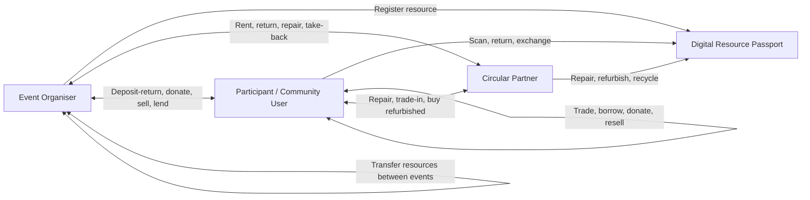
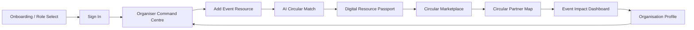
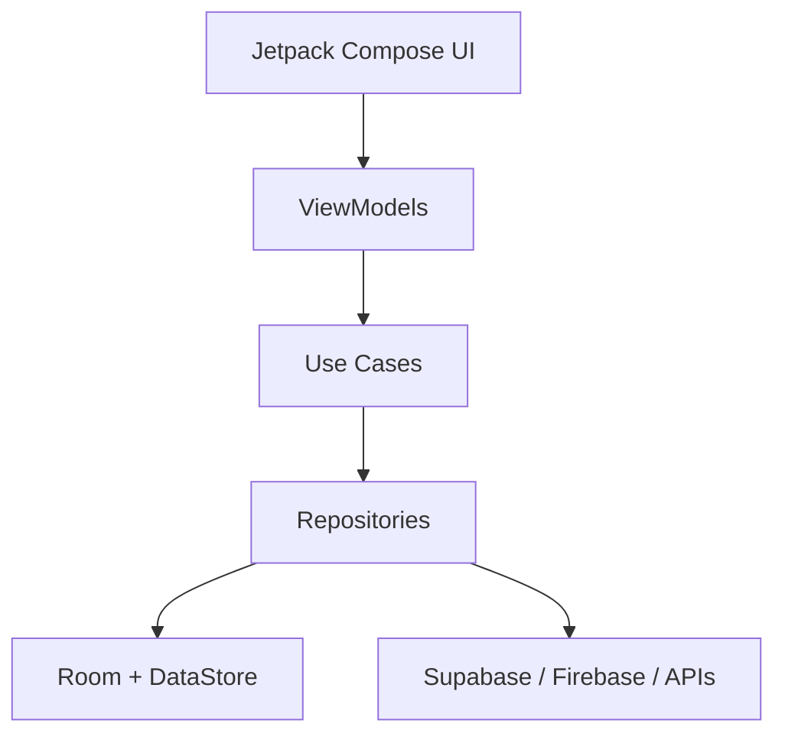

# ReEvent Full App Development Plan

## 1. Project Overview

**Project name:** ReEvent

**App type:** Android mobile application

**Core concept:** ReEvent is a circular event resource management app that helps event organisers, participants, and circular partners track, reuse, repair, return, donate, resell, refurbish, and recycle event-related resources.

**Main assignment alignment:** The app supports Circular Economy and Sustainable Consumption and Production under **UN Sustainable Development Goal 12: Responsible Consumption and Production**.

**High-scoring angle:** ReEvent is not a generic recycling marketplace. It is a focused event lifecycle platform using **digital resource passports**, **QR tracking**, **circular partner matching**, **peer-to-peer resource sharing**, **impact dashboards**, and optional **AI-assisted item assessment**.

---

## 2. Assignment Requirements Covered

| Requirement | ReEvent Implementation |
|---|---|
| Circular Economy or Sustainable Consumption and Production | ReEvent reduces event waste by keeping temporary event resources in use for longer. |
| SDG 12 alignment | Supports responsible consumption, waste prevention, reuse, repair, sustainable procurement, and user awareness. |
| Peer-to-peer resource optimisation | Users and organisers can lend, rent, exchange, donate, and transfer resources. |
| Behavioural transformation | Users receive circularity scores, event recovery progress, badges, and recommendations. |
| Closing the loop | Items can move from organiser/user to repair, refurbishment, resale, donation, take-back, or recycling partners. |
| Custom launcher icon | ReEvent launcher icon should combine a circular arrow, event ticket, and resource tag. |
| Mobile device storage | Room database stores users, events, resources, drafts, scan history, and cached partner programmes. |
| External endpoint / REST API / SDK | Supabase or Firebase backend plus Maps API and optional AI Vision API. |
| Functional mobile app | Build with Kotlin, Jetpack Compose, MVVM, local storage, backend sync, QR scan, and dashboard workflows. |
| Originality and commercial potential | Event waste is a clear domain with real users: universities, schools, councils, event agencies, NGOs, and conference organisers. |

---

## 3. Product Definition

### 3.1 Product Statement

ReEvent helps event organisers plan, track, and recover event resources before, during, and after an event. It connects organisers, participants, and circular partners so resources are reused instead of wasted.

### 3.2 Target Problem

Events often use many short-term resources such as banners, booth panels, badge holders, props, decorations, reusable cups, display stands, costumes, signage, gift bags, cables, and small equipment. After events, many usable items are thrown away, stored without purpose, or replaced with newly purchased materials.

The problem is not only waste disposal. The bigger problem is missing coordination:

- Organisers do not know what resources are still usable.
- Participants do not know what can be returned, reused, or exchanged.
- Circular partners do not know what recoverable materials are available.
- Items do not have a history, condition record, or next-use destination.
- Impact is rarely measured.

### 3.3 ReEvent Solution

ReEvent creates a circular resource loop using:

- Event resource inventory
- Digital resource passports
- QR code scanning
- Circular pathway recommendations
- Partner take-back programmes
- Peer-to-peer marketplace
- Event recovery dashboard
- Circularity and impact scoring

---

## 4. Main Stakeholders

### 4.1 Event Organisers

Examples:

- University clubs
- School event committees
- Government departments
- Conference organisers
- Exhibition organisers
- Event agencies
- Community event teams
- Charity event organisers

Needs:

- Plan resources before events
- Avoid unnecessary purchasing
- Track resources during events
- Recover materials after events
- Show sustainability impact

### 4.2 Participants and Community Users

Examples:

- Students
- Event attendees
- Volunteers
- Local residents
- Student clubs
- Community groups
- Small businesses

Needs:

- Return deposit items
- Borrow or rent event resources
- Exchange or buy second-hand event items
- Donate useful materials
- Understand their sustainability impact

### 4.3 Circular Partners

Examples:

- Rental suppliers
- Manufacturers
- Repair shops
- Refurbishers
- Upcycling workshops
- Recycling companies
- Donation centres
- NGOs
- Logistics providers
- Second-hand resellers

Needs:

- Receive suitable recovery requests
- State accepted materials and conditions
- Process repair, refurbishment, take-back, or recycling requests
- Report recovery outcomes

---

## 5. Circular Economy Model



### 5.1 Circular Pathway Priority

The app should recommend the best pathway in this order:

1. Reuse in the same organisation's future event.
2. Share with another organiser.
3. Rent or lend.
4. Sell or donate to users or community groups.
5. Repair.
6. Refurbish.
7. Return to supplier or take-back partner.
8. Recycle through approved partner.
9. Dispose only when no circular option is available.

---

## 6. MVP Scope

### 6.1 Recommended MVP Domain

The MVP should focus on **university and community events**, not world tours.

Reason:

- Easier to demonstrate.
- Easier to understand for lecturers.
- More realistic for a student group.
- Still has enough sustainability impact.
- Can expand to large concerts and government events later.

### 6.2 MVP Demo Event

**Demo event:** University Career Fair 2026

**Organiser:** Student Affairs Department

**Sample resources:**

- 40 booth panels
- 30 badge holders
- 20 acrylic signs
- 15 table covers
- 10 display stands
- 8 extension cables
- 100 reusable cups
- 50 gift bags

### 6.3 MVP Item Categories

Include:

- Booth panels
- Banners
- Posters
- Decorations
- Props
- Badge holders
- Reusable cups
- Display stands
- Table covers
- Storage boxes
- Extension cables
- Small lighting items
- Gift bags

Exclude for MVP:

- Hazardous waste
- Medical waste
- Food waste handling
- Chemicals
- Large structural equipment
- High-voltage systems
- Special battery disposal
- Legally sensitive items

---

## 7. Figma UI Modification Plan

### 7.1 Current Figma File

Current file:

https://www.figma.com/design/4pMwXhyFdlPTYovoOhyLY8

Current file key:

`4pMwXhyFdlPTYovoOhyLY8`

Current page:

`LoopLink Prototype`

The existing LoopLink prototype should be converted into ReEvent instead of being treated as a final UI.

### 7.2 UI Direction

The ReEvent UI should feel like a premium event operations and sustainability tool.

Avoid:

- Generic recycling app style
- Cheap green-only palette
- Oversized rounded cards
- Thin low-quality borders
- Empty AI-looking layouts
- Decorative blobs and fake gradients
- Random placeholder text

Use:

- Realistic event resource data
- Operational dashboards
- Dense but clean information
- Clear hierarchy
- Strong resource photos or generated event-resource images
- QR passport visuals
- Timeline and status indicators
- Maps and partner cards
- Charts and recovery progress
- Professional typography and spacing

### 7.3 Visual System

Recommended design tokens:

| Token | Value | Usage |
|---|---|---|
| Ink | `#101820` | Main text, strong headings |
| Graphite | `#2F3A3D` | Secondary text and icons |
| Cloud | `#F4F6F4` | App background |
| Surface | `#FFFFFF` | Cards and sheets |
| Loop Green | `#0E7C66` | Primary actions and success |
| Event Blue | `#2563EB` | Operations, maps, QR states |
| Amber | `#F2A93B` | Warnings, pending recovery |
| Coral | `#E85D75` | Damaged or attention states |
| Line | `#DDE4DF` | Borders and dividers |

Typography:

- Use Inter, SF Pro, or a clean modern sans-serif.
- Headings should be confident but not oversized.
- Body text should be readable at mobile scale.
- Avoid negative letter spacing.

Radius:

- Cards: 8px
- Buttons: 8px
- Chips: 16px maximum
- Image corners: 8px

### 7.4 Screen Conversion Map

| Existing Frame | Convert To | Purpose |
|---|---|---|
| `00 Style Guide - LoopLink` | `00 Style Guide - ReEvent` | Tokens, buttons, cards, chips, resource passport samples |
| `01 Onboarding` | `01 Onboarding / Role Select` | Introduce ReEvent and choose role |
| `02 Login` | `02 Sign In` | Login with role-aware trust copy |
| `03 Home Dashboard` | `03 Organiser Command Centre` | Event recovery overview and urgent actions |
| `04 Browse Listings` | `04 Circular Marketplace` | Browse reusable/rentable/donatable event items |
| `05 Listing Detail` | `05 Digital Resource Passport` | Item identity, condition, QR, history, next action |
| `06 Create Listing` | `06 Add Event Resource` | Add item to inventory with category, condition, photo, end plan |
| `07 AI Scan Result` | `07 AI Circular Match` | AI/rule-based assessment and recommended circular pathway |
| `08 Map Nearby` | `08 Circular Partner Map` | Nearby partners and accepted resource programmes |
| `09 Impact Dashboard` | `09 Event Impact Dashboard` | Recovery rate, items reused, CO2e estimate, money saved |
| `10 Profile` | `10 Organisation Profile` | User/organisation profile, programmes, contribution log |

### 7.5 Proposed Clickable Prototype Flow



### 7.6 Screen Details

#### Screen 1: Onboarding / Role Select

Goal:

Show the value of ReEvent and let the user choose a role.

Content:

- Brand: ReEvent
- Headline: Circular events start before teardown.
- Supporting copy: Track resources, recover materials, and prove event impact.
- Role cards:
  - Event Organiser
  - Participant
  - Circular Partner
- Primary action: Continue

Visual:

- Event setup photo or generated image showing booths, signage, reusable crates, and people preparing an event.
- Avoid a generic green leaf image.

#### Screen 2: Sign In

Goal:

Show login form and establish trust.

Content:

- Email
- Password
- Sign in
- Create account
- Trust copy: Built for universities, community events, and circular partners.

#### Screen 3: Organiser Command Centre

Goal:

The strongest first functional screen for demo.

Content:

- Current event: University Career Fair 2026
- Recovery progress: 83 percent planned
- Registered resources: 273
- Open actions:
  - 12 badge holders pending return
  - 5 acrylic signs need partner match
  - 1 display stand needs repair
- Primary actions:
  - Scan item
  - Add resource
- Resource cards:
  - Booth panels
  - Reusable cups
  - Acrylic signs

#### Screen 4: Circular Marketplace

Goal:

Fulfill peer-to-peer resource optimisation.

Content:

- Search
- Filters:
  - All
  - Rent
  - Donate
  - Repair
  - Take-back
- Listings:
  - 10 display stands available for rent
  - 50 gift bags available for donation
  - Fabric banners accepted by upcycling partner

#### Screen 5: Digital Resource Passport

Goal:

Show the unique innovation.

Content:

- Item photo
- QR code placeholder
- Item ID
- Category
- Material
- Condition
- Reuse count
- Event history
- Owner
- Recommended next action
- Passport timeline:
  - Registered
  - Used at event
  - Returned
  - Matched to partner

#### Screen 6: Add Event Resource

Goal:

Show local storage and data entry potential.

Fields:

- Event
- Item name
- Category
- Material
- Quantity
- Condition
- Ownership status
- Photo
- End-of-event plan

Actions:

- Save draft
- Generate passport

#### Screen 7: AI Circular Match

Goal:

Show advanced technical integration and behavioural nudging.

Content:

- Detected item: Acrylic signboard
- Condition: Scratched, reusable
- Material: Acrylic
- Recommended path:
  1. Reuse for next university fair
  2. Offer to another organiser
  3. Send damaged pieces to acrylic recycler
- Circular score: 91
- Button: Create recovery request

#### Screen 8: Circular Partner Map

Goal:

Show external endpoint/API value.

Content:

- Map view
- Partner pins
- Bottom sheet:
  - GreenCycle Materials
  - Accepts acrylic signs, fabric banners, metal stands
  - 2.4 km away
  - Pickup available
- Button: Request pickup

#### Screen 9: Event Impact Dashboard

Goal:

Show SDG 12 impact clearly.

Content:

- Event recovery rate: 83 percent
- Items reused or returned: 126
- Waste avoided: 20 kg
- Money saved: RM 850
- Repair wins: 1
- Circular partners used: 3
- Progress chart by resource category
- Badge: High Recovery Event

#### Screen 10: Organisation Profile

Goal:

Show account-level continuity.

Content:

- Organisation: Student Affairs Department
- Role: Event Organiser
- Rating or trust score
- Completed events
- Saved partner programmes
- Resource inventory
- Contribution log
- Settings

---

## 8. Functional Modules

### 8.1 Authentication and Role Management

Features:

- Sign up
- Login
- Logout
- Role selection
- Role-based dashboard

Roles:

- Organiser
- Participant
- Circular Partner
- Admin/demo user

### 8.2 Event Management

Features:

- Create event
- Edit event
- View event list
- View event detail
- Add event location
- Set sustainability target
- View event recovery progress

### 8.3 Resource Inventory

Features:

- Add resource
- Edit resource
- Upload photo
- Set quantity and condition
- Assign owner
- Set resource status
- Search and filter resources
- Save resource drafts offline

Statuses:

- Draft
- Registered
- In use
- Pending return
- Available
- Matched
- Repair requested
- Recycled
- Donated
- Completed

### 8.4 Digital Resource Passport

Features:

- Generate unique item ID
- Generate QR value
- View passport details
- View item history
- View condition history
- View ownership history
- View environmental impact

### 8.5 QR Scanner

Features:

- Scan QR code
- Open resource passport
- Check out item
- Return item
- Mark item damaged
- Request repair
- Transfer item
- Save scan history

### 8.6 Circular Marketplace

Features:

- Browse resources
- Filter by action type
- Filter by category
- Filter by location
- View item detail
- Request borrow/rent/buy/donate/exchange
- Approve or reject request
- Complete transaction

### 8.7 Circular Partner Programmes

Features:

- Partner creates accepted material programme
- Organiser sees suitable partners
- Partner receives request
- Partner updates status
- Partner reports outcome

Programme fields:

- Accepted categories
- Accepted materials
- Minimum condition
- Quantity limits
- Reward or fee
- Pickup/drop-off
- Location
- Processing time

### 8.8 Circular Matching Engine

Features:

- Recommend next action based on item type, condition, material, quantity, location, and partner rules.
- Show best pathway and alternatives.
- Explain why the recommendation is made.

Simple rule example:

```text
If condition is "Good" and reuseCount < 5:
  Recommend reuse or organiser-to-organiser transfer.

If condition is "Damaged" and category is repairable:
  Recommend repair partner.

If condition is "Unusable" and material has matching recycler:
  Recommend recycling partner.
```

### 8.9 Impact Dashboard

Features:

- Event recovery rate
- Items reused
- Items repaired
- Items donated
- Items recycled
- Waste avoided estimate
- CO2e saved estimate
- Money saved estimate
- Circularity score
- Badge/challenge results

### 8.10 Optional AI Feature

Features:

- Upload item image
- AI suggests category
- AI suggests material
- AI suggests condition
- AI recommends pathway

Fallback:

- If real AI is too difficult, use a rule-based classifier and present it as a prototype AI insight module.

---

## 9. Recommended Technical Stack

### 9.1 Android App

- Kotlin
- Jetpack Compose
- Material 3
- MVVM architecture
- Kotlin Coroutines
- Flow / StateFlow
- Navigation Compose
- Room database
- DataStore for user preferences
- Retrofit or Ktor for REST APIs
- Hilt for dependency injection

### 9.2 Backend

Recommended: Supabase

Reasons:

- Authentication
- PostgreSQL database
- REST API automatically available
- File storage for item photos
- Easy demo setup
- Good for student projects

Alternative: Firebase

Use Firebase if the team is more comfortable with:

- Firebase Auth
- Firestore
- Firebase Storage
- Cloud Messaging

### 9.3 External APIs / SDKs

Minimum external endpoint:

- Supabase REST API or Firebase SDK

Recommended additional endpoint:

- Google Maps SDK, Mapbox, or OpenStreetMap/Nominatim for partner location.

Optional advanced endpoint:

- OpenAI Vision API, Google ML Kit, or another image recognition service for item assessment.

### 9.4 QR / Barcode

Options:

- ML Kit Barcode Scanning
- ZXing

Use case:

- Generate QR values for item passports.
- Scan QR to open item detail and update item status.

---

## 10. Android Architecture



### 10.1 Suggested Package Structure

```text
com.reevent.app
  core
    data
    domain
    ui
    navigation
    util
  auth
    data
    domain
    presentation
  event
    data
    domain
    presentation
  resource
    data
    domain
    presentation
  passport
    data
    domain
    presentation
  marketplace
    data
    domain
    presentation
  partner
    data
    domain
    presentation
  scan
    data
    domain
    presentation
  impact
    data
    domain
    presentation
```

### 10.2 Navigation Routes

```text
splash
onboarding
login
roleSelect
organiserHome
eventDetail/{eventId}
addResource/{eventId}
resourcePassport/{itemId}
scan
aiMatch/{itemId}
marketplace
marketplaceDetail/{itemId}
partnerMap
partnerDetail/{partnerId}
impactDashboard/{eventId}
profile
settings
```

---

## 11. Data Model

### 11.1 User

```text
userId: String
name: String
email: String
phone: String?
role: UserRole
organisationName: String?
locationName: String?
sustainabilityScore: Int
createdAt: Long
updatedAt: Long
```

### 11.2 Event

```text
eventId: String
organiserId: String
eventName: String
eventType: String
startDate: Long
endDate: Long
locationName: String
latitude: Double?
longitude: Double?
expectedAttendance: Int
sustainabilityTarget: String
recoveryRate: Double
status: EventStatus
createdAt: Long
updatedAt: Long
```

### 11.3 ResourceItem

```text
itemId: String
eventId: String
ownerId: String
itemName: String
category: String
material: String
quantity: Int
condition: ItemCondition
photoUrl: String?
localPhotoPath: String?
qrCodeValue: String
status: ItemStatus
reuseCount: Int
estimatedValue: Double
recommendedAction: CircularAction?
currentLocationName: String
createdAt: Long
updatedAt: Long
```

### 11.4 ResourcePassport

```text
passportId: String
itemId: String
conditionHistoryJson: String
ownershipHistoryJson: String
eventUsageHistoryJson: String
repairHistoryJson: String
environmentalImpactJson: String
lastUpdated: Long
```

### 11.5 CircularProgramme

```text
programmeId: String
partnerId: String
programmeName: String
acceptedCategoriesJson: String
acceptedMaterialsJson: String
minimumCondition: ItemCondition
rewardType: RewardType
rewardAmount: Double?
feeAmount: Double?
pickupAvailable: Boolean
locationName: String
latitude: Double?
longitude: Double?
processingTimeDays: Int
terms: String
status: ProgrammeStatus
```

### 11.6 CircularTransaction

```text
transactionId: String
itemId: String
fromUserId: String
toUserId: String
transactionType: TransactionType
status: TransactionStatus
dateRequested: Long
dateCompleted: Long?
notes: String?
```

### 11.7 ImpactRecord

```text
impactId: String
eventId: String
itemId: String
actionType: CircularAction
wasteAvoidedKg: Double
estimatedCO2eSaved: Double
moneySaved: Double
createdAt: Long
```

---

## 12. Local Storage Plan

Use Room for structured app data and DataStore for lightweight preferences.

### 12.1 Room Tables

- users
- events
- resource_items
- resource_passports
- circular_programmes
- circular_transactions
- impact_records
- scan_history
- draft_resources

### 12.2 DataStore Preferences

- selected_role
- auth_session_cache
- last_opened_event_id
- onboarding_completed
- preferred_distance_unit
- theme_mode

### 12.3 Offline-First Behaviours

Important for event venues:

- Add resource offline.
- Save scan history offline.
- Save draft recovery requests.
- Queue sync when internet returns.
- Cache partner programmes.
- Cache latest dashboard metrics.

---

## 13. Backend Schema

Recommended Supabase tables:

```text
profiles
events
resource_items
resource_passports
circular_programmes
circular_transactions
impact_records
partner_locations
notifications
```

### 13.1 Supabase Storage Buckets

```text
resource-photos
partner-logos
event-photos
profile-avatars
```

### 13.2 Security Rules

Basic rules:

- Users can read public marketplace listings.
- Users can update their own profile.
- Organisers can manage their own events and resources.
- Partners can manage their own programmes.
- Transactions can be read by involved users only.
- Impact records can be read by event organisers and involved partners.

---

## 14. Development Phases

## Phase 0: Team Setup and Scope Lock

Goal:

Make sure the team has one clear build target.

Tasks:

- Confirm project name: ReEvent.
- Confirm MVP event type: university/community events.
- Confirm user roles.
- Confirm app modules.
- Assign team roles.
- Create GitHub repository.
- Set branch naming rules.
- Create issue board.

Deliverables:

- Final app scope
- Team responsibility table
- GitHub repository
- Project board

Exit criteria:

- Every member knows what they own.
- MVP is not too broad.

## Phase 1: Proposal and UI Prototype

Goal:

Prepare the Week 5 proposal and polished Figma prototype.

Tasks:

- Write problem statement.
- Explain SDG 12 alignment.
- Explain the three requirement areas:
  - Peer-to-peer resource optimisation
  - Behavioural transformation
  - Closing the loop
- Prepare UI wireflow.
- Convert current LoopLink Figma prototype into ReEvent.
- Build clickable flow.
- Create UI style guide.
- Prepare proposal screenshots.

Deliverables:

- Proposal document
- Figma prototype
- Style guide
- Screen flow diagram

Target assignment date:

- Week 5 Wednesday, 15 July 2026 before 5 PM.

Exit criteria:

- Proposal can explain the idea in under 2 minutes.
- Figma screens clearly show ReEvent, not LoopLink.

## Phase 2: Android Project Foundation

Goal:

Create a clean and scalable app foundation.

Tasks:

- Create Android project.
- Set Kotlin and Gradle versions.
- Add Jetpack Compose.
- Add Material 3.
- Add Navigation Compose.
- Add Hilt.
- Add Room.
- Add DataStore.
- Add Retrofit/Ktor.
- Add QR scanner dependency.
- Build app theme based on Figma tokens.
- Create launcher icon.

Deliverables:

- Running Android app
- App navigation scaffold
- App theme
- Dependency setup

Exit criteria:

- App launches successfully.
- Navigation between placeholder screens works.

## Phase 3: Authentication and Role Onboarding

Goal:

Make the app role-based.

Tasks:

- Build onboarding screen.
- Build role selection.
- Build login screen.
- Connect authentication backend.
- Save selected role locally.
- Redirect users to correct dashboard.

Deliverables:

- Onboarding flow
- Login flow
- Role-based routing

Exit criteria:

- Organiser, participant, and partner users can reach different dashboards.

## Phase 4: Event and Resource Inventory

Goal:

Build the core organiser workflow.

Tasks:

- Create event model.
- Build create event screen.
- Build event detail screen.
- Build organiser dashboard.
- Create resource model.
- Build add resource screen.
- Save resources locally with Room.
- Sync resources to backend.
- Upload resource photo.

Deliverables:

- Event CRUD
- Resource CRUD
- Resource inventory list
- Local and remote persistence

Exit criteria:

- Organiser can create an event and add resources to it.

## Phase 5: Digital Resource Passport and QR

Goal:

Build the main innovation.

Tasks:

- Generate unique item IDs.
- Generate QR code values.
- Build passport detail screen.
- Build QR scanner screen.
- Open item passport after scanning.
- Add scan actions:
  - Check out
  - Return
  - Mark damaged
  - Request repair
  - Transfer
- Save scan history.

Deliverables:

- Resource passport
- QR generation
- QR scanner
- Scan history

Exit criteria:

- Scanning a QR code opens the correct resource passport.

## Phase 6: Circular Matching Engine

Goal:

Make the app feel smart and assignment-worthy.

Tasks:

- Create partner programme model.
- Create circular action enum.
- Build rule-based matching logic.
- Match resource to suitable programmes.
- Show best recommendation.
- Show alternative recommendations.
- Explain recommendation reason.
- Allow user to create recovery request.

Deliverables:

- AI/rule match screen
- Recommendation engine
- Recovery request flow

Exit criteria:

- App can recommend a circular pathway based on item condition and material.

## Phase 7: Marketplace and Peer-to-Peer Flow

Goal:

Fulfill peer-to-peer resource optimisation.

Tasks:

- Build marketplace list.
- Add search.
- Add filters.
- Build item detail.
- Create transaction request.
- Approve/reject request.
- Complete transaction.
- Support organiser-to-organiser transfer.
- Support user-to-user exchange.

Deliverables:

- Marketplace
- Transaction model
- Request/approval workflow

Exit criteria:

- A user can request an item and the owner can approve it.

## Phase 8: Circular Partner Module and Map

Goal:

Connect event resources with real recovery pathways.

Tasks:

- Build partner profile.
- Build create programme screen.
- Build programme list.
- Add map screen.
- Show partner pins.
- Show partner detail bottom sheet.
- Request pickup/drop-off.

Deliverables:

- Partner dashboard
- Partner programme CRUD
- Map screen
- Pickup/drop-off request

Exit criteria:

- Organiser can find a suitable partner for a resource.

## Phase 9: Impact Dashboard and Gamification

Goal:

Show behavioural transformation and SDG 12 impact.

Tasks:

- Calculate event recovery rate.
- Count reused items.
- Count repaired items.
- Count donated items.
- Count recycled items.
- Estimate waste avoided.
- Estimate money saved.
- Estimate CO2e saved.
- Build dashboard charts.
- Add badges and challenges.

Deliverables:

- Event impact dashboard
- Circularity score
- Badges/challenges

Exit criteria:

- App can show measurable impact after actions are completed.

## Phase 10: Optional AI Enhancement

Goal:

Add an advanced feature for higher marks.

Tasks:

- Add image picker/camera.
- Upload image.
- Call AI or ML classifier.
- Detect category/material/condition.
- Use result in circular matching.
- Show confidence and recommendation.

Deliverables:

- AI scan result
- AI-assisted circular pathway

Exit criteria:

- App can demonstrate item assessment from a photo.

Fallback:

- Use mock AI result with realistic UI if API integration becomes unstable.

## Phase 11: Testing and QA

Goal:

Make the app stable enough for live demo.

Tasks:

- Unit test matching logic.
- Unit test impact calculations.
- Test Room DAOs.
- Test repository sync behaviour.
- Test invalid forms.
- Test role routing.
- Test QR scanning.
- Test offline drafts.
- Test UI on multiple screen sizes.
- Fix spacing and text overflow.

Deliverables:

- Test cases
- Bug fixes
- Stable demo build

Exit criteria:

- Main demo scenario works without crashing.

## Phase 12: Report, Presentation, and Submission

Goal:

Prepare final assignment materials.

Tasks:

- Write final report under page limit.
- Include screenshots.
- Explain architecture.
- Explain local storage.
- Explain external API.
- Explain SDG 12 alignment.
- Explain circular economy loops.
- Explain member roles.
- Show GitHub contribution evidence.
- Prepare presentation slides.
- Prepare demo script.
- Prepare Q&A answers.

Deliverables:

- Final app APK/source code
- Final report
- Presentation slides
- GitHub repository
- Demo script

Target assignment date:

- Week 12 Saturday, 5 September 2026 before 5 PM.

Exit criteria:

- App, report, screenshots, source code, and presentation are ready.

---

## 15. Team Work Distribution

Assuming four students:

| Member | Main Ownership | Details |
|---|---|---|
| Member 1 | Backend and architecture | Supabase/Firebase, data models, repositories, API sync, authentication |
| Member 2 | UI and navigation | Jetpack Compose screens, theme, navigation, visual polish, Figma-to-code translation |
| Member 3 | Resource and QR module | Event inventory, resource passport, QR generation/scanning, local Room storage |
| Member 4 | Matching, impact, and documentation | Circular matching engine, impact dashboard, gamification, report, slides |

Every member should commit code regularly to GitHub.

Recommended branch names:

```text
feature/auth-role-onboarding
feature/event-inventory
feature/resource-passport-qr
feature/circular-matching
feature/marketplace
feature/partner-map
feature/impact-dashboard
docs/final-report
```

---

## 16. Demo Script

### Demo Story

The demo should follow one complete event lifecycle.

Event:

`University Career Fair 2026`

### Step-by-step Demo

1. Login as event organiser.
2. Open organiser command centre.
3. Show recovery progress and open actions.
4. Add an event resource: acrylic signboard.
5. Generate digital resource passport.
6. Scan the QR code.
7. Open AI Circular Match.
8. Show recommendation: reuse first, then recycle damaged pieces.
9. Open marketplace and show resource transfer/donation options.
10. Open partner map and select GreenCycle Materials.
11. Create recovery request.
12. Open impact dashboard.
13. Show updated recovery rate, waste avoided, and money saved.

### Demo Result

The lecturer should clearly see:

- Data is stored.
- API/backend is used.
- QR scanning works.
- App supports circular economy.
- App supports SDG 12.
- App has a polished UI.
- App is more original than a normal marketplace.

---

## 17. Testing Plan

### 17.1 Unit Tests

Test:

- Circular matching rules
- Impact calculation
- Recovery rate calculation
- Transaction state changes
- Validation rules

### 17.2 Integration Tests

Test:

- Local database save/read/update
- Backend sync
- Image upload
- Authentication
- QR scan to passport

### 17.3 Manual UI Tests

Test:

- Onboarding flow
- Login flow
- Create event
- Add resource
- Scan item
- View passport
- Request circular match
- Browse marketplace
- Request transaction
- View map
- View impact dashboard

### 17.4 Demo Readiness Tests

Before presentation:

- Use fixed demo account.
- Use fixed demo event.
- Preload sample data.
- Test on actual presentation device.
- Record backup demo video.
- Prepare screenshots in case live API fails.

---

## 18. Risks and Mitigation

| Risk | Impact | Mitigation |
|---|---|---|
| Scope too large | App may be incomplete | Focus MVP on organiser workflow, resource passport, matching, marketplace, and dashboard. |
| AI integration unstable | Demo may fail | Build rule-based matching first and treat AI as optional. |
| Map API setup issue | Partner map may fail | Use mock partner coordinates or OpenStreetMap fallback. |
| QR scanning difficult | Core demo weakens | Implement QR early and test repeatedly. |
| Backend permissions complex | Data sync errors | Start with simple authenticated rules, tighten later. |
| UI inconsistent | Looks low quality | Follow Figma tokens and reusable Compose components. |
| Team commits uneven | Documentation marks lost | Assign clear modules and require weekly commits. |

---

## 19. Scoring Strategy

### 19.1 Creativity and Novelty

Score high by emphasising:

- Event-specific circular economy.
- Digital resource passport.
- QR tracking.
- Circular partner acceptance rules.
- Before/during/after event lifecycle.
- Impact measurement.

### 19.2 Completeness

Score high by building a complete vertical slice:

- Login
- Create event
- Add resource
- Generate passport
- Scan QR
- Match pathway
- Request partner/marketplace action
- Show impact dashboard

### 19.3 UI Design

Score high by ensuring:

- No generic recycling visuals.
- Event-resource imagery.
- Strong dashboard hierarchy.
- Consistent spacing.
- Clear buttons and cards.
- Clean forms.
- Realistic data.
- No text overflow.

### 19.4 Technical Requirements

Score high by showing:

- Custom launcher icon.
- Room local storage.
- External API/backend connection.
- QR scanner.
- Cloud image upload.
- Map or AI integration.

### 19.5 Documentation and Presentation

Score high by including:

- Clear diagrams.
- Screenshots.
- Architecture explanation.
- Database design.
- Member contribution table.
- GitHub commit evidence.
- Risk mitigation.
- Demo script.

---

## 20. Minimum Viable Feature Priority

If time becomes limited, build in this order:

1. Role-based login.
2. Organiser dashboard.
3. Event creation.
4. Resource inventory.
5. Digital resource passport.
6. QR scanner.
7. Circular matching result.
8. Marketplace request.
9. Partner map or partner list.
10. Impact dashboard.

Do not spend too much time on:

- Real payment
- Complex logistics
- Large-scale concert operations
- Full chat system
- Real-time tracking
- Advanced admin panel

These are future enhancements.

---

## 21. Future Enhancements

After MVP:

- Large concert and world tour support
- Supplier procurement scorecards
- Multi-event warehouse inventory
- Real logistics integration
- Smart reusable cup deposit system
- NFC tags instead of only QR
- Public impact reports
- Organisation sustainability ranking
- Partner certification badges
- Carbon accounting API integration
- App store publication

---

## 22. Final Recommended Build Target

The best final version for the assignment is:

**A polished Android app where an organiser can manage a university event, register resources, generate digital resource passports, scan QR codes, receive circular pathway recommendations, connect with users or circular partners, and see measurable SDG 12 impact.**

This target is realistic enough to build and impressive enough to score high marks.

