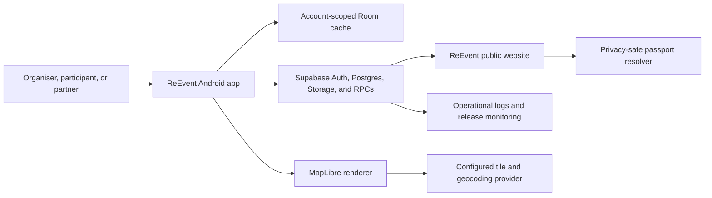

# ReEvent 1.0 Architecture Contract

**Status:** Frozen for Stage 2 implementation  
**Contract version:** 1.0.0  
**Frozen on:** 2026-08-09  
**Release target:** Publicly publishable Huawei AppGallery assignment demo

This document defines the final ReEvent 1.0 system boundaries and authority model. It describes the target that later migrations and Android changes must implement; it does not claim that the current prototype already behaves this way.

## 1. Architectural principles

1. Supabase/Postgres is authoritative for identity, roles, shared data, resource ownership, transaction state, ReCoin balances, passport history, and impact.
2. The Android client is never the security authority. It may predict which actions are available, but Postgres functions and row-level security make the decision.
3. Room is an account- and environment-scoped cache. It is not an independent source of shared truth.
4. Cross-role and value-bearing mutations are atomic, idempotent, and online-only.
5. Offline behavior is explicit. ReEvent may queue private drafts, but it never displays a critical shared action as completed before the server accepts it.
6. QR tokens identify a passport; they do not authorise a write.
7. ReCoins are fictional, non-purchasable assignment currency with no cash value, withdrawal, or conversion.
8. Environmental results are estimates with recorded factor provenance and unavailable states for unsupported inputs.

## 2. System context



### Component responsibilities

| Component | Owns | Must not own |
|---|---|---|
| Android UI | Rendering, input, permission prompts, navigation, honest pending/error state | Role enforcement, balance calculation, final transaction state |
| ViewModels/use cases | Client validation, orchestration, mapping domain results to UI state | Direct table writes for critical shared transitions |
| Domain layer | Typed models, validators, QR parsing, deterministic matching and impact display rules | Environment secrets or Android framework dependencies |
| Repositories | Offline draft policy, cache observation, remote calls, mapping and error classification | Fabricating server success or swallowing authorisation failures |
| Room | Per-account cached projections, private drafts, non-critical outbox | Global shared authority, canonical balances, canonical passport history |
| Supabase Auth | User identity and verified session | Client-selected authority after profile role is frozen |
| Postgres/RPC | RLS, roles, state machine, quantity allocation, ownership, ReCoin, completion and deletion | Trusting actor IDs or critical statuses supplied by the client |
| Supabase Storage | Resource/profile media with authorised access | Publicly enumerable private paths |
| Website | Legal/support pages, Android App Link fallback, privacy-safe passport view | Private app data or write actions from an anonymous QR visit |

## 3. Android application boundaries

The dependency direction is one way:

```text
Compose UI -> ViewModel -> Use case -> Repository interface -> Local/remote implementation
                                      -> Pure domain policy
```

- Compose screens consume immutable screen state and emit user intents.
- ViewModels call named use cases; they do not construct multi-record domain writes.
- Use cases distinguish local-draft actions from server-authoritative actions.
- Repository interfaces expose typed results and sync states. Supabase SDK types do not leak into UI or domain code.
- Local and remote data-transfer objects map explicitly to domain objects. An unknown enum or malformed row becomes a visible data error, not an omitted list item.
- Hilt provides environment-scoped gateways. Production cannot bind demo/fake auth or seed repositories.

## 4. Environments and configuration

| Environment | Android variant | Backend/site | Allowed data | Release rule |
|---|---|---|---|---|
| Local/test | `debug` | Local fakes or isolated test Supabase | Disposable fixtures | Debuggable; never uploaded |
| Staging | `staging` | Separate Supabase project and staging website | Synthetic organiser, participant and partner accounts | Used for E2E and AppGallery open testing |
| Production | `release` | Production Supabase project and canonical HTTPS website | Public demo user data | Signed, non-debuggable AppGallery candidate |

Each variant supplies typed values for:

- `APP_ENVIRONMENT`;
- `SUPABASE_URL`;
- `SUPABASE_ANON_KEY`;
- `PUBLIC_BASE_URL`;
- `MAP_STYLE_URL` and any public map-provider token allowed in a mobile client;
- monitoring environment/release identifiers.

Required configuration is validated during build. `staging` and `release` fail to build when a required value is absent or uses another environment's host. No Supabase service-role key, signing password, private map secret, test credential, or support mailbox password is embedded in source or an APK/AAB.

The production variant contains no universal login, automatic role bypass, demo repository, staging seed reset, local fake success, or debug endpoint. A staging reset is an administrator-only backend operation and is not callable by the shipped client.

## 5. Data ownership and cache identity

- Server IDs are globally unique UUIDs.
- Every cached shared row is identified locally by `(environment, account_id, record_id)`, not only `record_id`.
- `account_id` means the authenticated subject whose authorised projection is cached; it does not replace the record's server owner.
- A public resource may legitimately be cached by multiple accounts without one account overwriting another's projection.
- Private profile/email data is stored only for the active account unless a specific public display projection is returned by the server.
- Sign-out cancels account-scoped work, closes observation, clears session material, and prevents the next account from reading or executing the prior account's outbox.
- Remote deletion or lost authorisation removes the affected cached projection during reconciliation; it does not delete another account's copy.

## 6. Read and write paths

### 6.1 Server-backed reads

1. UI observes an account-scoped Room projection.
2. Repository refresh requests the authorised Supabase projection.
3. A successful refresh replaces/upserts returned rows and removes locally cached rows explicitly absent from the authoritative projection.
4. An HTTP, parsing, RLS, or table error is retained and surfaced. It is never converted to a successful empty list.
5. Room emits the resulting content and sync metadata to the UI.

### 6.2 Offline-capable private edits

Only organiser-owned event/resource drafts and non-critical profile preferences may enter the local outbox.

1. A Room transaction writes the draft and outbox row together.
2. The outbox row stores environment, account, operation, record ID, payload version, attempts, last error and next-attempt time.
3. WorkManager uses a unique name containing environment and account ID.
4. The worker runs only when its account matches the current authenticated subject.
5. Poison rows use bounded retries and terminal failure; they cannot starve later rows.
6. UI distinguishes `LOCAL_ONLY`, `PENDING`, `SYNCED`, and `FAILED`.

### 6.3 Online-only critical mutations

The following are never placed in the generic offline outbox:

- publish or reserve a marketplace listing;
- request, approve, reject, cancel or advance a transaction;
- create/release/settle a ReCoin hold;
- transfer or split resource ownership;
- append authoritative passport history;
- create completion impact/reward records;
- delete an account.

When offline, the app may decode a QR and show already cached privacy-safe data, but any offered lifecycle action remains disabled with an explicit connection requirement.

## 7. Server command interface

All commands derive the caller from `auth.uid()`, validate the caller's frozen role, execute in one Postgres transaction, accept a caller-generated UUID idempotency key, and return the same saved response when the same key and request hash are replayed.

| RPC | Required input | Authoritative effect |
|---|---|---|
| `request_transaction` | listing/programme ID, type, quantity, optional counter-resource, optional due date, idempotency key | Validates eligibility and creates `REQUESTED` transaction |
| `approve_transaction` | transaction ID, idempotency key | Rechecks availability/balance, reserves quantity/resources, creates ReCoin hold, sets `APPROVED` |
| `reject_transaction` | transaction ID, optional reason, idempotency key | Decision actor rejects a requested transaction |
| `cancel_transaction` | transaction ID, optional reason, idempotency key | Allowed actor cancels before physical handover and releases allocations/hold |
| `begin_handover` | transaction ID, resource side for exchange, idempotency key | Records authorised handover; moves workflow to `IN_TRANSIT` when applicable |
| `confirm_receipt` | transaction ID, resource side for exchange, idempotency key | Records receipt; activates a temporary workflow or completes a permanent workflow |
| `begin_return` | transaction ID, idempotency key | Borrower/renter/repair partner starts the return, setting `RETURN_IN_PROGRESS` |
| `complete_transaction` | transaction ID, idempotency key | Original owner confirms return; settles hold, releases allocation and creates completion effects once |
| `resolve_public_passport` | opaque token | Returns only the privacy-safe passport projection; performs no write |
| `delete_account` | idempotency key after recent reauthentication | Cancels work that has not entered physical custody and releases its holds; returns deletion-pending for in-transit/active/return work; then removes PII/media/session and anonymises retained history |

Critical tables deny direct client insert/update/delete except where a narrowly scoped non-critical operation is explicitly documented. Stage 2 will implement the functions and RLS from the state contract in `data-contract.md`.

## 8. Transaction completion boundary

One completion database transaction performs all applicable effects or none:

1. lock transaction, listing/programme, allocation, wallet/hold and affected resource rows;
2. verify caller, current state, receipt/return confirmations and request hash;
3. settle or release ReCoins;
4. update quantity allocation and split/transfer/recover the resource where required;
5. close or reduce the listing/programme capacity;
6. append immutable passport events;
7. create one impact record and one eligible circular reward;
8. mark the transaction `COMPLETED` and save the idempotent response.

Unique constraints on transaction completion, impact `transaction_id`, reward `(transaction_id, reward_policy_version)`, active hold `transaction_id`, and passport-event idempotency prevent double effects.

## 9. QR and web data flow

The app renders `${PUBLIC_BASE_URL}/p/v1/<opaque-token>` as a standard QR symbol.

- Android verified App Links route supported URLs into ReEvent.
- If the app is unavailable, the website renders the same privacy-safe projection returned by `resolve_public_passport`.
- Authentication may reveal an authorised richer in-app projection, but the token alone never grants write authority.
- The website and Android client derive the URL from environment configuration; an environment-specific full URL is not stored as passport identity.
- Revoked/retired tokens return a stable unavailable/retired response without exposing whether a private user or event exists.

## 10. Failure semantics

| Failure | Client behavior | Persistence behavior |
|---|---|---|
| Offline during online-only action | Keep current state; show connection-required message | No optimistic critical write |
| Authentication expired | Preserve non-sensitive input, require sign-in, then re-read server state | No command executes under cached identity |
| Forbidden actor/role | Explain action is unavailable and refresh | No partial write |
| Validation or insufficient balance | Show field/domain reason | No hold, allocation or transition |
| Concurrent conflict | Refresh resource/transaction and explain changed availability | Losing request has no partial effects |
| Duplicate idempotency key, same request | Return original result | Exactly-once observable effect |
| Duplicate key, different request | Reject as idempotency conflict | No new effect |
| Server/network uncertainty | Show outcome unknown and query by idempotency key | Never blindly resubmit with a new key |
| Cache parsing/version error | Show data error and retain diagnostic | Do not silently drop the row |
| Terminal draft-sync failure | Show failed state and retry/discard choice | Later queue rows continue |

## 11. Security and privacy boundaries

- Profile role selection is one-time and server-controlled; the client cannot promote itself.
- Exact user coordinates are never required for marketplace browsing. Event/resource/programme coordinates and an optional coarse current location drive distance.
- Public passport output contains no email, auth UUID, internal actor ID, private note, storage path or exact private venue.
- Media downloads use short-lived signed URLs or an equivalently narrow authorised policy.
- Logs contain environment, release, command type, error category and correlation/idempotency ID; they exclude QR token, email, photo bytes, access tokens and free-text private notes.
- Account deletion follows the exact anonymisation and ReCoin burn contract in `data-contract.md`.

## 12. Operational ownership

The project owner must assign named owners before production for Supabase, website/domain, signing key, map quota, support/privacy requests and AppGallery. Production migrations run before the dependent Android release, have a forward-fix/rollback runbook, and are verified by server contract tests. Staging and production monitoring use separate alert streams.

## 13. Stage boundary

This contract completes architectural design only. Stage 1 does not:

- add Gradle variants or secrets;
- change Kotlin models, Room entities or repositories;
- apply Supabase migrations/functions/RLS;
- implement ReCoin wallets or transaction UI;
- replace QR, map or other runtime surfaces;
- change AppGallery or website deployment.

Those changes begin only after all Stage 1 contracts pass the cross-document validation recorded in `decisions.md`.
