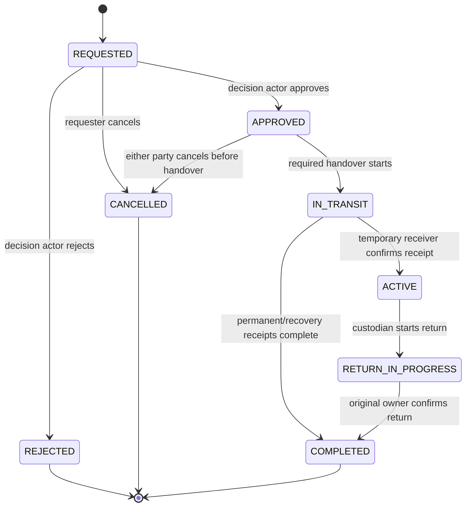

# ReEvent 1.0 Data and State-Machine Contract

**Status:** Frozen for Stage 2 implementation  
**Contract version:** 1.0.0  
**Frozen on:** 2026-08-09

This is the canonical ReEvent 1.0 domain and persistence contract. Postgres is authoritative. Kotlin and Room mirror authorised projections and must preserve the meanings below.

## 1. Conventions

| Concept | Contract |
|---|---|
| Identifier | UUID generated by server or cryptographically secure client where explicitly accepted |
| Time | `timestamptz` in Postgres; UTC epoch milliseconds in Android; event timezone stored as IANA identifier |
| Quantity | `numeric(12,3)`, greater than zero; `ITEM` and `BOX` require an integer; `KG` permits three decimals |
| ReCoins | Signed/unsigned `bigint` whole units; no decimals, cash value, purchase, withdrawal or conversion |
| Coordinates | WGS84 latitude `numeric(9,6)` and longitude `numeric(9,6)`; both null or both present |
| Text | Trimmed; blank is rejected when the field is required; private notes never enter a public projection |
| Soft terminal data | `archived_at`/status fields preserve integrity; completed transaction/passport/ledger/impact rows are immutable |
| Client cache key | `(environment, account_id, server_record_id)` for every shared projection |
| Idempotency | UUID key unique per authenticated actor and RPC; same key plus different request hash is rejected |

## 2. Frozen enumerations

```text
UserRole = ORGANIZER | PARTICIPANT | PARTNER

EventStatus = DRAFT | ACTIVE | COMPLETED | ARCHIVED
EventType = CONFERENCE | EXHIBITION | FESTIVAL | WORKSHOP | COMMUNITY | OTHER

ResourceCondition = NEW | GOOD | FAIR | NEEDS_REPAIR | END_OF_LIFE
ResourceStatus = DRAFT | ACTIVE | RECOVERY_IN_PROGRESS | RECOVERED | ARCHIVED
QuantityUnit = ITEM | BOX | KG

ListingStatus = DRAFT | PUBLISHED | RESERVED | CLOSED | CANCELLED
TransactionType = BORROW | RENT | BUY | DONATE | EXCHANGE | REPAIR | RECYCLE | BUY_BACK
TransactionStatus = REQUESTED | APPROVED | IN_TRANSIT | ACTIVE | RETURN_IN_PROGRESS | COMPLETED | REJECTED | CANCELLED
AllocationState = RESERVED | IN_CUSTODY | RELEASED | TRANSFERRED | CONSUMED

ProgrammeType = REPAIR | RECYCLE | BUY_BACK
CoinDirection = FREE | OWNER_PAYS_PARTNER | PARTNER_PAYS_OWNER
HoldStatus = ACTIVE | SETTLED | RELEASED
LedgerEntryType = INITIAL_GRANT | CIRCULAR_REWARD | SETTLEMENT_IN | SETTLEMENT_OUT | ACCOUNT_CLOSE_BURN | ADMIN_CORRECTION

PassportTokenStatus = ACTIVE | REVOKED | RETIRED
PassportEventType = CREATED | LISTED | RESERVED | CHECKED_OUT | RETURN_STARTED | RETURNED | OWNERSHIP_TRANSFERRED | SPLIT_FROM | SPLIT_TO | CONDITION_CHANGED | REPAIR_STARTED | REPAIRED | RECYCLED | ARCHIVED

SyncState = LOCAL_ONLY | PENDING | SYNCED | FAILED
```

`RETURN` is not a transaction type. It is represented by `RETURN_IN_PROGRESS` and passport events within `BORROW`, `RENT`, or `REPAIR`.

## 3. Authority and ownership rules

1. A verified user has exactly one frozen role. Role changes require an administrator process outside the mobile client.
2. Only an organiser may create a root resource, and its `origin_event_id` must reference an event owned by that organiser.
3. Any verified role may become `current_owner_id` through a completed `BUY`, `DONATE`, `EXCHANGE`, or `BUY_BACK`, and may relist the acquired active resource.
4. Borrow, rent, and repair move custody only; ownership does not change.
5. Recycling consumes the completed quantity and never transfers it back into marketplace inventory.
6. A root resource may be split only by the server during a partial permanent transfer/recovery. A child retains origin, parent, provenance and a new passport.
7. A user may edit a resource only while they are current owner and the edit cannot invalidate an active allocation or immutable history.
8. A listing owner is snapshotted from the resource owner at publication and revalidated for every command.
9. A transaction actor ID is always derived or validated by the server. The client cannot select the caller, owner, sender, receiver, partner, payer or payee arbitrarily.

## 4. Authoritative entities

The names below are the target logical names. Stage 2 migrations may preserve an existing physical name only if the meaning, constraints and public API remain identical.

### 4.1 `profiles`

| Field | Type/nullability | Rule |
|---|---|---|
| `id` | UUID PK, not null | References `auth.users`; self identity |
| `display_name` | Text, not null | 1–80 characters; removed on account deletion |
| `role` | `UserRole`, not null after onboarding | Set once through server function |
| `avatar_path` | Text, nullable | Private storage path, never public passport output |
| `role_frozen_at` | Timestamp, not null | Set when onboarding role is accepted |
| `created_at`, `updated_at` | Timestamp, not null | Server timestamps |

Email remains in Supabase Auth and is not duplicated into public/shared projections. Deleting an account removes the profile after dependent private data is resolved.

### 4.2 `events`

| Field | Type/nullability | Rule |
|---|---|---|
| `id` | UUID PK | Server/global identity |
| `owner_id` | UUID FK profile, nullable only after account deletion | Must be an organiser while event is actionable; deletion archives the event before nulling identity |
| `name` | Text, not null | 1–120 characters |
| `description` | Text, not null | Maximum 2,000 characters |
| `event_type` | `EventType`, not null | Required before activation |
| `starts_at`, `ends_at` | Timestamp, not null | End strictly after start |
| `timezone_id` | Text, not null | Valid IANA timezone |
| `address_text` | Text, not null | Required before activation |
| `latitude`, `longitude` | Coordinate pair, nullable in draft | Required before activation |
| `expected_attendance` | Integer, nullable in draft | Positive when provided; required before activation |
| `recovery_target_percent` | Numeric(5,2), not null | 0–100, default 0 |
| `status` | `EventStatus`, not null | Default `DRAFT` |
| `created_at`, `updated_at`, `archived_at` | Timestamp | `archived_at` only with `ARCHIVED` |

An event cannot be archived while it has a non-terminal transaction unless those transactions are first resolved.

### 4.3 `resources`

| Field | Type/nullability | Rule |
|---|---|---|
| `id` | UUID PK | Resource lot identity |
| `origin_event_id` | UUID FK event, not null | Never changes across ownership transfer/split |
| `parent_resource_id` | UUID self-FK, nullable | Set only for server-created split child |
| `created_by` | UUID FK profile, nullable after deletion | Original organiser |
| `current_owner_id` | UUID FK profile, nullable only after deletion/archive | Current legal app owner |
| `title` | Text, not null | 1–120 characters |
| `description` | Text, not null | Maximum 2,000 characters |
| `category`, `material` | Text, not null | Normalised catalog value plus display label mapping |
| `condition` | `ResourceCondition`, not null | Server validates transition/history |
| `quantity` | Quantity, not null | Remaining lot quantity |
| `unit` | `QuantityUnit`, not null | Immutable after first listing/transaction |
| `status` | `ResourceStatus`, not null | Default `DRAFT`; marketplace availability is not encoded here |
| `address_text` | Text, nullable | Inherits event at creation when omitted |
| `latitude`, `longitude` | Coordinate pair, nullable | Used for matching/map; both or neither |
| `reuse_count` | Integer, not null | Default 0; server increments on completed return/reuse lifecycle |
| `created_at`, `updated_at`, `archived_at` | Timestamp | Server maintained |

Availability is computed as:

```text
available_quantity = resource.quantity
                   - sum(active RESERVED allocation quantities)
                   - sum(active IN_CUSTODY allocation quantities that still belong to this lot)
```

It is never trusted from a client-supplied number.

### 4.4 `resource_photos`

| Field | Type/nullability | Rule |
|---|---|---|
| `id` | UUID PK | Photo identity |
| `resource_id` | UUID FK resource | Cascade only before immutable/shared history; otherwise explicit cleanup |
| `storage_path` | Text, not null | Owner-scoped opaque path |
| `mime_type` | Text, not null | Allowed validated image type |
| `width`, `height`, `byte_size` | Integer, not null | Validated upload metadata |
| `sort_order` | Integer, not null | Non-negative, unique per resource |
| `created_at` | Timestamp, not null | Server timestamp |

Only authorised projections receive a short-lived signed URL. Storage paths do not enter public QR output.

### 4.5 `resource_passports`

| Field | Type/nullability | Rule |
|---|---|---|
| `id` | UUID PK | Passport identity |
| `resource_id` | UUID unique FK resource | Exactly one active passport per resource lot |
| `qr_version` | Small integer, not null | `1` for this contract |
| `public_token` | URL-safe 128-bit random token, unique | Contains no resource/user UUID or PII |
| `token_status` | `PassportTokenStatus` | Default `ACTIVE` |
| `replacement_passport_id` | UUID self-FK, nullable | Set when revoked/replaced |
| `created_at`, `updated_at`, `retired_at` | Timestamp | `retired_at` for final retirement |

The QR string is derived as `${PUBLIC_BASE_URL}/p/v1/<public_token>` and is not stored as an environment-specific identity.

### 4.6 `passport_events`

| Field | Type/nullability | Rule |
|---|---|---|
| `id` | UUID PK | Immutable event identity |
| `passport_id` | UUID FK passport | Required |
| `transaction_id` | UUID FK transaction, nullable | Present for transaction lifecycle events |
| `event_type` | `PassportEventType` | Required |
| `actor_id` | UUID FK profile, nullable after deletion | Never in public projection |
| `quantity`, `unit` | Quantity/unit, nullable together | Required for quantity lifecycle events |
| `previous_condition`, `new_condition` | Condition, nullable | Both used for condition change |
| `public_summary` | Text, not null | Server-generated, no PII |
| `private_note` | Text, nullable | Authorised in-app viewers only |
| `occurred_at` | Timestamp, not null | Server time |
| `idempotency_key` | UUID, not null | Unique per passport/command effect |

Rows are append-only. A correction appends a new event; it never edits history.

### 4.7 `marketplace_listings`

P2P listings support only `BORROW`, `RENT`, `BUY`, `DONATE`, and `EXCHANGE`. Repair, recycle, and buy-back use partner programmes.

| Field | Type/nullability | Rule |
|---|---|---|
| `id` | UUID PK | Listing identity |
| `resource_id` | UUID FK resource | One non-terminal listing per resource |
| `seller_id` | UUID FK profile, nullable only for terminal listing after account deletion | Must equal current owner at publish/command time |
| `allowed_actions` | Non-empty set of P2P transaction types | Condition/ownership compatible |
| `published_quantity` | Quantity | Cannot exceed current available quantity |
| `unit_coin_price_buy` | ReCoins, nullable | Required and positive when `BUY` allowed |
| `unit_coin_price_rent` | ReCoins, nullable | Required and positive when `RENT` allowed |
| `default_duration_days` | Integer, nullable | Required for borrow/rent; 1–365 |
| `terms` | Text, not null | Maximum 2,000 characters; no real-money claim |
| `status` | `ListingStatus` | Default `DRAFT` |
| `created_at`, `updated_at`, `published_at`, `closed_at` | Timestamp | State-consistent |

Borrow and donate have zero ReCoin price. Exchange has no coin price and requires an offered whole resource in the request.

### 4.8 `circular_programmes`

| Field | Type/nullability | Rule |
|---|---|---|
| `id` | UUID PK | Programme identity |
| `partner_id` | UUID FK profile, nullable only for inactive historical programme after account deletion | Must have partner role while programme is active |
| `name` | Text, not null | 1–120 characters |
| `programme_type` | `ProgrammeType` | Repair, recycle or buy-back |
| `accepted_categories`, `accepted_materials` | Text arrays, not null | Empty means wildcard; comparison is normalised |
| `accepted_conditions` | Condition array, not null | Non-empty |
| `minimum_quantity`, `maximum_quantity` | Quantity, nullable | When both set, maximum >= minimum |
| `unit` | Quantity unit, nullable | Required when quantity limits or unit price are set |
| `remaining_capacity` | Quantity, nullable | Null means unmetered; never negative |
| `coin_direction` | `CoinDirection` | Repair: free or owner pays; recycle/buy-back: free or partner pays |
| `unit_coin_amount` | ReCoins, nullable | Required positive unless direction is `FREE` |
| `pickup_available` | Boolean, not null | Default false |
| `address_text` | Text, not null | Required while active |
| `latitude`, `longitude` | Coordinate pair, not null while active | Real partner marker/location |
| `processing_method`, `terms` | Text, not null | Required while active |
| `active` | Boolean, not null | Only active programmes are eligible |
| `created_at`, `updated_at` | Timestamp | Server maintained |

### 4.9 `circular_transactions`

| Field | Type/nullability | Rule |
|---|---|---|
| `id` | UUID PK | Transaction identity |
| `listing_id` | UUID FK listing, nullable | Exactly one of listing/programme is present |
| `programme_id` | UUID FK programme, nullable | Exactly one of listing/programme is present |
| `origin_event_id` | UUID FK event | Copied from primary resource |
| `resource_id` | UUID FK resource | Primary resource |
| `counter_resource_id` | UUID FK resource, nullable | Required only for exchange; cannot equal primary |
| `requester_id` | UUID FK profile, nullable after deletion | Authenticated request creator |
| `sender_id` | UUID FK profile, nullable after deletion | Primary resource owner at request |
| `receiver_id` | UUID FK profile, nullable after deletion | Intended primary receiver |
| `partner_id` | UUID FK profile, nullable | Required for programme transaction |
| `transaction_type` | `TransactionType` | Compatible with source listing/programme |
| `status` | `TransactionStatus` | Server state machine only |
| `quantity`, `unit` | Quantity/unit | Unit must match primary resource |
| `coin_payer_id`, `coin_payee_id` | UUID, nullable together | Derived from action/programme |
| `unit_coin_amount`, `total_coin_amount` | ReCoins, not null | Server-calculated immutable snapshot; zero for free/exchange |
| `due_at` | Timestamp, nullable | Required for borrow/rent; after approval time |
| `reward_policy_version` | Text, not null | `reevent-demo-reward-v1` |
| `request_reason` | Text, nullable | Private to authorised actors |
| `terminal_reason` | Text, nullable | Required for reject/cancel |
| `created_at`, `approved_at`, `in_transit_at`, `active_at`, `return_started_at`, `completed_at`, `updated_at` | Timestamp, nullable by state | Server maintained |

For a unit-price transaction:

```text
total_coin_amount = ceiling(unit_coin_amount * quantity)
```

The snapshot never changes after approval, even if the listing/programme is later edited.

### 4.10 `transaction_allocations`

| Field | Type/nullability | Rule |
|---|---|---|
| `id` | UUID PK | Allocation identity |
| `transaction_id` | UUID FK transaction | Required |
| `resource_id` | UUID FK resource | Primary or exchange counter resource |
| `side` | `PRIMARY` or `COUNTER` | Counter only for exchange |
| `quantity`, `unit` | Quantity/unit | Exchange quantity equals entire counter lot |
| `state` | `AllocationState` | Server state machine |
| `created_at`, `updated_at` | Timestamp | Server maintained |

Row locking plus an exclusion/constraint check prevents the sum of active allocations from exceeding resource quantity.

### 4.11 `transaction_confirmations`

| Field | Type/nullability | Rule |
|---|---|---|
| `transaction_id` | UUID FK transaction | Composite PK component |
| `actor_id` | UUID FK profile | Composite PK component |
| `resource_side` | `PRIMARY` or `COUNTER` | Counter used only for exchange |
| `confirmation_type` | `HANDOVER`, `RECEIPT`, or `RETURN` | Expected actor is derived |
| `confirmed_at` | Timestamp | Server timestamp |
| `idempotency_key` | UUID unique | Prevents duplicate confirmation |

Exchange completes only after both parties have confirmed receipt of the opposite whole resource.

### 4.12 `recoin_wallets`

| Field | Type/nullability | Rule |
|---|---|---|
| `id` | UUID PK | Stable wallet identity retained for ledger integrity |
| `profile_id` | UUID unique FK profile, nullable after account deletion | One open wallet per verified profile; null only after close/burn |
| `available_balance` | Bigint, not null | Never negative |
| `held_balance` | Bigint, not null | Never negative |
| `version` | Bigint, not null | Optimistic/audit version |
| `created_at`, `updated_at`, `closed_at` | Timestamp | Closed on deletion |

Creation atomically adds an append-only `INITIAL_GRANT` of 1,000 ReCoins. No client may directly update balances.

### 4.13 `recoin_holds`

| Field | Type/nullability | Rule |
|---|---|---|
| `id` | UUID PK | Hold identity |
| `transaction_id` | UUID unique FK transaction | At most one hold per transaction |
| `payer_wallet_id`, `payee_wallet_id` | UUID FK wallet | Different wallets; server-derived and retained after profile deletion |
| `amount` | Positive bigint | Equals transaction total |
| `status` | `HoldStatus` | `ACTIVE`, then exactly one terminal state |
| `created_at`, `settled_at`, `released_at` | Timestamp | State-consistent |

Approval locks the payer wallet and creates the hold in the same database transaction. Cancellation/rejection releases it; completion settles it.

### 4.14 `recoin_ledger_entries`

| Field | Type/nullability | Rule |
|---|---|---|
| `id` | UUID PK | Immutable entry |
| `entry_group_id` | UUID, not null | Groups double-entry settlement or single system mint/burn |
| `wallet_id` | UUID FK wallet | Target wallet |
| `transaction_id` | UUID FK transaction, nullable | Required for settlement/reward |
| `hold_id` | UUID FK hold, nullable | Required for settlement entries |
| `entry_type` | `LedgerEntryType` | Required |
| `amount` | Signed bigint, non-zero | Sum of transfer group is zero; system mint/burn is explicitly typed |
| `reward_policy_version` | Text, nullable | Required for circular reward |
| `created_at` | Timestamp | Server timestamp; row immutable |

Only the initial grant and circular rewards mint ReCoins. `ADMIN_CORRECTION` is unavailable to the mobile client and requires an operational audit reason in a protected admin record.

### 4.15 `impact_factors`

| Field | Type/nullability | Rule |
|---|---|---|
| `id` | UUID PK | Factor identity |
| `factor_version` | Text unique | Human-auditable version |
| `transaction_type` | Transaction type | `RECYCLE` for the enabled factor |
| `material_key` | Text | `average_plastics`; plastic/acrylic map to it with disclosed limitation |
| `input_unit` | Quantity unit | `KG` |
| `kg_co2e_per_unit` | Numeric, not null | `1.59710826` |
| `source_name`, `source_url` | Text, not null | UK DESNZ 2025 conversion factors |
| `published_on`, `accessed_on` | Date, not null | 2025-06-10 and 2026-08-09 |
| `mapping_note`, `scope_note` | Text, not null | Includes acrylic approximation and exclusions |
| `active` | Boolean | Version is retained after replacement |

### 4.16 `impact_records`

| Field | Type/nullability | Rule |
|---|---|---|
| `id` | UUID PK | Immutable completion result |
| `transaction_id` | UUID unique FK transaction | Exactly one per completed transaction |
| `event_id`, `resource_id` | UUID FKs | Required source scope |
| `transaction_type` | Transaction type | Snapshot |
| `completed_quantity`, `unit` | Quantity/unit | Always present |
| `material_diverted_kg` | Numeric, nullable | Present only for supported mass result |
| `emissions_avoided_kg` | Numeric, nullable | Present only when factor exists |
| `factor_id` | UUID FK factor, nullable | Required when emissions value exists |
| `recoins_transferred` | Bigint, not null | Default 0; actual settlement amount |
| `recoins_rewarded` | Bigint, not null | Default 0; actual minted circular reward |
| `calculated_at` | Timestamp | Same authoritative completion boundary |

Unsupported environmental results are null, not zero. Dashboard channel/quantity counts still include every completed transaction.

### 4.17 `idempotency_records`

| Field | Type/nullability | Rule |
|---|---|---|
| `actor_id` | UUID FK profile with delete cascade | Composite unique component; operational replay data is removed with the account rather than retained as public history |
| `function_name` | Text | Composite unique component |
| `idempotency_key` | UUID | Composite unique component |
| `request_hash` | Text | Canonical request hash |
| `response_json` | JSONB, nullable until committed | Original response |
| `created_at`, `expires_at` | Timestamp | Retained at least through transaction terminal state and release audit period |

## 5. Transaction meaning and actors

| Type | Source | Payer → payee | Ownership/custody outcome | Completion reward |
|---|---|---|---|---:|
| `BORROW` | P2P listing | None | Receiver holds temporarily; owner unchanged; due date required | 5 to receiver after confirmed return |
| `RENT` | P2P listing | Receiver → owner | Temporary custody; fee settles after confirmed return | 5 to receiver after confirmed return |
| `BUY` | P2P listing | Receiver → owner | Completed quantity permanently transfers to receiver | None |
| `DONATE` | P2P listing | None | Completed quantity permanently transfers to receiver | 10 to donating sender |
| `EXCHANGE` | P2P listing + whole counter lot | None | Whole resource ownership swaps after both receipts | None |
| `REPAIR` | Partner programme | Owner → partner when programme charges | Partner custody, then item returns to owner | 15 to owner after confirmed repaired return |
| `RECYCLE` | Partner programme | Partner → owner when programme rewards | Completed quantity becomes recovered/consumed | 10 to sending owner |
| `BUY_BACK` | Partner programme | Partner → owner | Completed quantity permanently transfers to partner | None |

Programme-funded recycle/buy-back amounts are transfers from the partner wallet, not minted system rewards.

## 6. State machine

### 6.1 Universal transitions



- Terminal states are immutable.
- Cancellation is forbidden after the first physical handover confirmation.
- `IN_TRANSIT -> COMPLETED` applies to buy, donate, exchange, recycle and buy-back.
- `IN_TRANSIT -> ACTIVE -> RETURN_IN_PROGRESS -> COMPLETED` applies to borrow, rent and repair.
- Exchange remains `IN_TRANSIT` until both sides have confirmed receipt; then it completes atomically.
- An overdue borrow/rent remains `ACTIVE`; it is visibly overdue but incurs no automatic fee, late penalty, ownership transfer or hidden dispute process.

### 6.2 Action matrix

| Command | Required state | Caller | Key checks/effects |
|---|---|---|---|
| Request | Listing/programme active | Verified requester, not prohibited self-request | Quantity/action/eligibility; exchange counter owner/whole/available; create `REQUESTED` |
| Approve P2P | `REQUESTED` | Primary resource owner | Recheck listing/quantity; reserve allocation; create payer hold if priced |
| Approve programme | `REQUESTED` | Programme partner | Recheck capacity/terms/wallet; reserve allocation/capacity; create hold if priced |
| Reject | `REQUESTED` | Listing owner or programme partner | Terminal reason; no hold/allocation remains |
| Cancel requested | `REQUESTED` | Requester | Close request; no balance effect |
| Cancel approved | `APPROVED`, before handover | Requester or decision actor | Release allocation/capacity and hold |
| Begin handover | `APPROVED` | Current custodian for the indicated side | Record confirmation; set `IN_TRANSIT` when required handover begins |
| Confirm temporary receipt | `IN_TRANSIT` | Borrower/renter/repair partner | Allocation becomes `IN_CUSTODY`; set `ACTIVE` |
| Confirm permanent receipt | `IN_TRANSIT` | Receiver; both actors for exchange | Complete only when all required receipts exist |
| Begin return | `ACTIVE` | Borrower/renter/repair partner | Set `RETURN_IN_PROGRESS`; append return event |
| Complete return | `RETURN_IN_PROGRESS` | Original owner | Confirm custody returned; settle/release, reward and impact exactly once |

## 7. Quantity, split and ownership effects

### Temporary actions

- Borrow, rent and repair reserve the requested quantity without reducing the resource lot.
- The allocation changes from `RESERVED` to `IN_CUSTODY`, then `RELEASED` on return.
- Other transactions may use only the remaining computed available quantity.
- Ownership never changes; passport history records quantity and custody events.
- Borrow/rent leave the resource lifecycle `ACTIVE`. A full-lot repair becomes `RECOVERY_IN_PROGRESS` after handover and returns to `ACTIVE` after confirmed repair return; a partial repair keeps the parent `ACTIVE` and exposes the in-custody quantity through its allocation.

### Full permanent action

- Buy, donate or buy-back transfers `current_owner_id` of the existing lot when the completed quantity equals the lot quantity and there are no other active allocations.
- The old listing closes. The new owner may create a new listing.
- Passport history records the transfer without exposing actor identity publicly.
- A full-lot buy-back becomes `RECOVERY_IN_PROGRESS` during partner custody and `ACTIVE` under the partner after completion. Buy/donate remain `ACTIVE` throughout the ownership transfer.

### Partial permanent action

In the same completion transaction:

1. reduce the source lot by completed quantity;
2. create a child resource with that quantity, the same origin event/unit/material/category, `parent_resource_id` pointing to the source, and the receiver as owner;
3. create a child passport and opaque token;
4. append `SPLIT_TO` to the parent passport and `SPLIT_FROM` plus ownership event to the child;
5. settle ReCoins and create one impact record for the completed quantity.

### Recycling

- A full-lot recycle handover becomes `RECOVERY_IN_PROGRESS` while the partner is receiving it.
- Full recycling sets the resource `RECOVERED` and allocation `CONSUMED`.
- Partial recycling creates a recovered child lot/passport for the consumed quantity and reduces the active parent lot.
- Recovered lots cannot be listed unless a later explicitly supported server process creates a new active recovered-material product; that process is outside 1.0.

### Exchange

- Both resources must be `ACTIVE`, wholly available, owned by different verified users, use no active conflicting listing/allocation, and be the entire lot.
- Approval reserves both lots.
- Each party confirms handover/receipt for their side.
- Final receipt swaps both `current_owner_id` values, closes both listings, appends both passport histories and completes once.

## 8. ReCoin invariants

1. Initial grant: exactly 1,000 ReCoins once after verified profile/role completion.
2. Available and held balances are never negative.
3. A hold cannot exceed available balance and moves amount from available to held atomically.
4. Settlement creates equal `SETTLEMENT_OUT` and `SETTLEMENT_IN` entries in one group; transfer groups sum to zero.
5. Release returns the held amount to available balance without ledger mint/transfer.
6. Circular rewards mint fixed values under `reevent-demo-reward-v1`: returned borrow/rent 5, donation 10, repair 15, recycling 10.
7. Each transaction receives at most one system reward for its eligible outcome.
8. Buy and rent prices use whole ReCoins per unit; total is rounded upward once at request/approval snapshot.
9. No API exists for purchase, withdrawal, cash conversion, arbitrary gifting or self top-up.
10. Staging reset is administrator-only and writes auditable corrections outside the mobile API.

## 9. Matching contract

Matching is deterministic and is labelled **Smart Match** or **Circular Match**.

### Hard eligibility

- Actor may request the selected action and is not the prohibited same owner/partner.
- Resource/listing/programme is active and not archived.
- Requested action is allowed by the listing or programme type.
- Requested quantity is available and within programme capacity/quantity rules.
- Unit is compatible.
- Material, category and condition satisfy the programme's explicit list; an empty material/category list is a wildcard, but accepted conditions are never empty.
- Exchange counter-resource is a different whole eligible lot owned by the requester.

Missing action, quantity, unit, category, material or condition makes the item ineligible and the UI asks the owner to complete the data. Missing coordinates do not fabricate distance: the candidate remains eligible after known-distance candidates and displays `Distance unavailable`.

### Score after eligibility

| Signal | Points |
|---|---:|
| Exact material; wildcard material | 30; 15 |
| Exact category; wildcard category | 20; 10 |
| Distance <=5 km; <=15 km; <=50 km; >50 km/unknown | 25; 18; 8; 0 |
| Capacity at least twice requested; otherwise sufficient | 15; 8 |
| Pickup requested and offered | 10 |

Tie-break order is higher score, known/shorter distance, case-insensitive programme/listing name, then UUID. The result exposes the contributing reasons and all hard exclusions; the same input always produces the same order.

## 10. QR contract

```text
Version: 1
Payload: ${PUBLIC_BASE_URL}/p/v1/<public_token>
Token: URL-safe cryptographically random 128-bit value
```

- Parser accepts HTTPS, the configured environment host, exact `/p/v1/` path and one valid token segment only.
- It rejects another host, HTTP outside local tests, query-based actor/resource IDs, extra path segments, malformed/short tokens and unsupported version.
- Token has no natural expiry because printed passports must remain readable. It may be revoked/replaced or retired; write authority always requires authenticated server validation.
- Public result: title, category, material, condition, resource lifecycle status and server-generated public passport summaries/timestamps.
- Never public: email, display identity, auth/actor/resource UUID, exact private address, private notes, storage path, wallet, transaction terms, or any write action.
- Existing `reevent://passport/<UUID>` payloads are legacy. Stage 2 creates v1 opaque tokens and supports a temporary authenticated migration resolver only; new codes never use the legacy scheme.

## 11. Impact boundary

Every completed transaction creates one immutable channel record containing quantity, unit, action, event/resource and actual ReCoins transferred/rewarded.

Numeric CO2e is enabled only when all conditions match:

- transaction is `RECYCLE` and `COMPLETED`;
- material normalises to `plastic` or `acrylic`;
- unit is `KG`;
- completed quantity is positive;
- active factor version is the documented UK DESNZ 2025 average-plastics difference.

```text
material_diverted_kg = completed_quantity
emissions_avoided_kg = completed_quantity * 1.59710826
display rounding = 2 decimal places, half-up
stored precision = unrounded numeric result
```

The factor derives from `(3172.49932 - 1575.39106) / 1000`. Acrylic is explicitly an average-plastics approximation. Transport, local energy, contamination, collection, item-to-mass inference and unsupported action/material combinations are excluded. Unsupported `material_diverted_kg`, `emissions_avoided_kg`, and `factor_id` are null and displayed as unavailable.

Recovery rate is quantity-based within the selected event and does not count repeated reuse cycles more than once:

```text
eligible_quantity = original event resource quantity in a compatible unit grouping
recovered_quantity = distinct qualifying quantity across each root-resource lineage,
                     capped at that lineage's original quantity
recovery_rate = recovered_quantity / eligible_quantity * 100
```

Different units are not summed into one quantity. The dashboard reports separate unit groups and transaction channels. Borrow/rent count as recovered only after at least one confirmed return, while later returns increase `reuse_count` but not the capped recovery numerator. Buy alone is an ownership transfer and is reported separately, not environmental recovery.

## 12. Account deletion contract

Deletion requires a recently reauthenticated session and runs as one idempotent server workflow:

1. reject new commands for the account and cancel all `REQUESTED`/`APPROVED` transactions where cancellation is still legal;
2. release their allocations, programme capacity and ReCoin holds;
3. if an account has an in-transit/active/return transaction, require it to reach a safe terminal state before final destructive deletion while showing a deletion-pending state;
4. cancel/unpublish listings and deactivate owned partner programmes;
5. archive owned events and remaining owned resources; set their owner references null after private ownership is no longer actionable;
6. remove profile/resource-avatar media that is not required as an authorised shared resource photo; remove all private storage paths and signed links;
7. after every hold has settled or released, assert held balance is zero, append `ACCOUNT_CLOSE_BURN` for the final available demo balance, and close the wallet;
8. null retained actor foreign keys and retain only role/action/time/quantity snapshots required for completed passport, transaction, ledger-integrity and impact history;
9. remove display name, email/auth user, avatar, sessions and private notes attributable only to the deleting account;
10. return a deletion receipt ID without exposing internal retained identifiers.

Public history renders `Deleted user`; it retains no stable public pseudonym that can be linked across resources. Completed rows remain immutable and non-identifying. Because ReCoins have no cash value, burned balances are not refunded or transferred.

## 13. Cache and deletion reconciliation

- Room stores each authorised projection under environment/account identity.
- Refresh responses include a server revision/watermark or complete scope boundary so removed authorisation can be reconciled.
- Sign-out clears private projections and prevents old-account work execution; public data may be re-fetched for the next account but is not silently reused under the new identity.
- A deleted/retired remote passport becomes an explicit retired/unavailable local result.
- Local-only drafts owned by a deleted account are removed during confirmed deletion/sign-out cleanup.
- Completed immutable history is cached only when the active account remains authorised to view its projection.

## 14. Required database constraints

- Unique active passport per resource and unique active public token.
- Unique non-terminal listing per resource.
- Exactly one of listing/programme per transaction.
- Counter resource present only for exchange.
- Due date present only/always as required for borrow/rent.
- Payer/payee and positive amount present together for priced actions.
- One active/terminal hold per transaction.
- One impact record and one eligible system reward per completed transaction.
- No allocation total above resource quantity.
- No negative wallet balance/capacity/quantity.
- Valid timestamp/status combinations.
- No update/delete of completed transaction, passport event, ledger entry or impact record.
- Actor/function/idempotency key uniqueness with request-hash replay protection.

## 15. Stage 2 migration requirement

Stage 2 must migrate from the current narrow events/resources/passport JSON/programmes/transactions/impact schema to this contract without claiming compatibility until Kotlin, Room, RPC, RLS and tests agree. Current staging seed data is disposable; production migration must preserve any released data or explicitly block release until a clean production schema is established.
